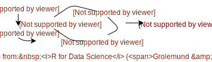

class: inverse, middle

## Data Science Workflow

<div align="center">
  
</div>

???

I love this diagram from the R for Data Science book.

Concisely captures the main components.

---
class: inverse, middle

## Expository vis

<p></p>

<div align="center">
  
</div>

???

The web has become the preferred medium for communicating results.

Once you know what you want to show, lots of good options out there!!

---
class: inverse, middle

## Exploratory vis

<p></p>

<div align="center">
  
</div>

* Data scientists have to juggle many technolgies (R, Python, JavaScript)

???

JavaScript lacks tools for iteration (necessary for exploration/discovery!)


```{r setup, echo = FALSE}
library(plotly)
knitr::opts_chunk$set(
  message = FALSE,
  fig.width = 10,
  fig.height = 4,
  comment = "#>",
  collapse = TRUE,
  eval = FALSE
)
```


---
background-image: url(europe.png)
background-size: contain
class: inverse

---

```r
library(tidyverse)
library(ggplot2)

*# read and clean data
d <- read_csv('GEOSTAT_grid_POP_1K_2011_V2_0_1.csv') %>%
  rbind(read_csv('JRC-GHSL_AIT-grid-POP_1K_2011.csv') %>%
          mutate(TOT_P_CON_DT = '')) %>%
  mutate(
    lat = as.numeric(gsub('.*N([0-9]+)[EW].*', '\\1', GRD_ID))/100,
    lng = as.numeric(gsub('.*[EW]([0-9]+)', '\\1', GRD_ID)) * ifelse(gsub('.*([EW]).*', '\\1', GRD_ID) == 'W', -1, 1) / 100
  ) %>%
  filter(lng > 25, lng < 60) %>%
  group_by(lat = round(lat, 1), lng = round(lng, 1)) %>%
  summarize(value = sum(TOT_P, na.rm = T))  %>%
  ungroup() %>%
  tidyr::complete(lat, lng)

*# visualize
ggplot(d, aes(lng, lat + 5*(value / max(value, na.rm = T)))) +
  geom_line(
    aes(group = lat, text = paste("Population:", value)),
    size = 0.4, alpha = 0.8, color = '#5A3E37', na.rm = T
  ) +
  coord_equal(0.9) + 
  ggthemes::theme_map()

```

---

```r
library(tidyverse)
*library(plotly)

d <- read_csv('GEOSTAT_grid_POP_1K_2011_V2_0_1.csv') %>%
  rbind(read_csv('JRC-GHSL_AIT-grid-POP_1K_2011.csv') %>%
          mutate(TOT_P_CON_DT = '')) %>%
  mutate(
    lat = as.numeric(gsub('.*N([0-9]+)[EW].*', '\\1', GRD_ID))/100,
    lng = as.numeric(gsub('.*[EW]([0-9]+)', '\\1', GRD_ID)) * ifelse(gsub('.*([EW]).*', '\\1', GRD_ID) == 'W', -1, 1) / 100
  ) %>%
  filter(lng > 25, lng < 60) %>%
  group_by(lat = round(lat, 1), lng = round(lng, 1)) %>%
  summarize(value = sum(TOT_P, na.rm = T))  %>%
  ungroup() %>%
  tidyr::complete(lat, lng)

*# make each latitude "highlight-able"
*sd <- crosstalk::SharedData$new(d, ~lat)

ggplot(sd, aes(lng, lat + 5*(value / max(value, na.rm = T)))) +
  geom_line(
    aes(group = lat, text = paste("Population:", value)),
    size = 0.4, alpha = 0.8, color = '#5A3E37', na.rm = T
  ) +
  coord_equal(0.9) + 
  ggthemes::theme_map()
  
*ggplotly()
```

---

<iframe src="europe.html" width="100%" height="750" scrolling="no" seamless="seamless" frameBorder="0"> </iframe>

---
class: inverse, center, middle

# Need more convincing?

Tooltips & zooming are cool -- but we can do more! 

plotly supports animation and multiple linked views -- without a web server/shiny!

Let's explore the world of capabilities with examples

---
class: center, middle

<a href="https://twitter.com/jalapic/status/732360615730266112" target="_blank" >
  
</a>

---

See `demo("highlight-epl", package = "plotly")`

<a href="epl.html">
  <div align="center">
    
  </div>
</a>

---
class: bottom, inverse, center

TODO: More examples!

---
background-image: url(you-can-do-it.gif)
background-size: contain
class: bottom, inverse, center

<p></p>New to R? Lets cover some [fundamentals](basics.Rmd)
