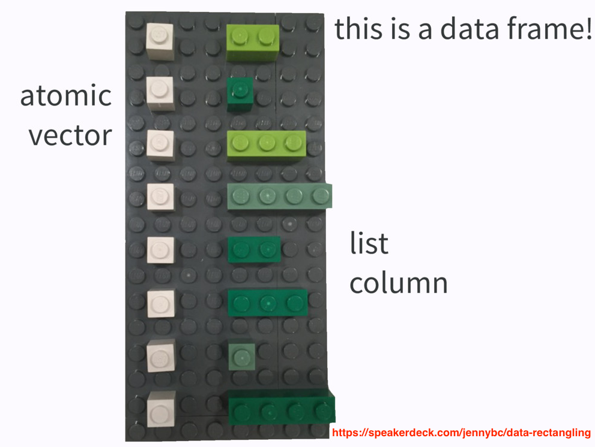
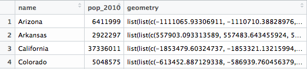
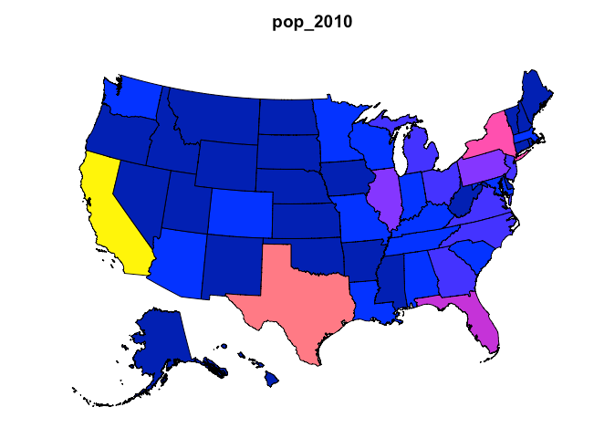
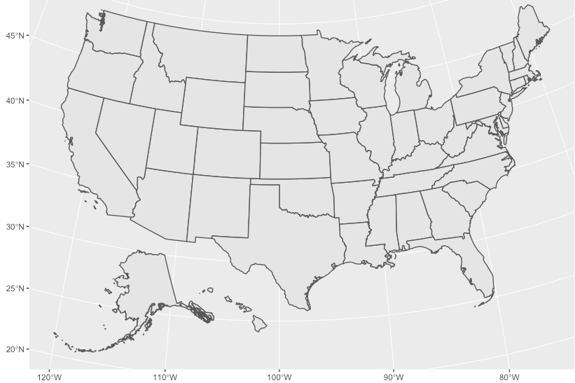
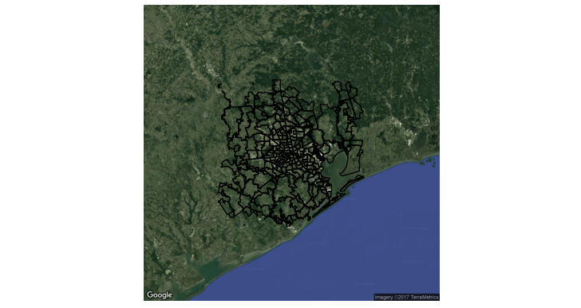
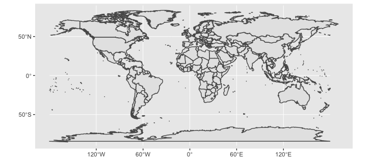
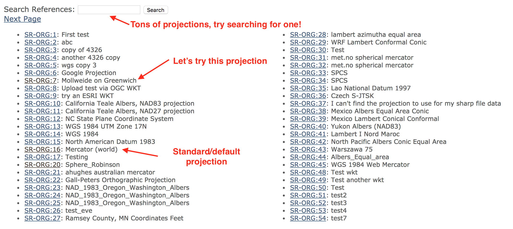
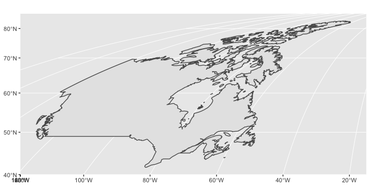

background-image: url(data.png)
background-size: contain

```{r, include = FALSE}
library(plotly)
knitr::opts_chunk$set(
  eval = FALSE,
  message = FALSE,
  fig.width = 10,
  fig.height = 4,
  comment = "#>",
  collapse = TRUE
)
```

## R's basic data structures


.footnote[
Read Hadley Wickham's brilliant chapter on data structures http://adv-r.had.co.nz/Data-structures.html
]


---
background-image: url(data2.png)
background-size: contain

## A data frame holds (homo or hetero!) 1d vectors.


.footnote[
Read Hadley Wickham's brilliant chapter on data structures http://adv-r.had.co.nz/Data-structures.html
]

---
## More than a table


<div align="center" >
  
</div>

.footnote[
Watch Jenny Bryan's brilliant talk https://www.youtube.com/watch?v=4MfUCX_KpdE
]

---
class: inverse, middle, center
background-image: url(https://media.giphy.com/media/h4Z6RfuQycdiM/giphy.gif)
background-size: contain


# How is this useful?

---

# What data goes into drawing this map?


<iframe src="map.html" width="100%" height="550" scrolling="no" seamless="seamless" frameBorder="0"> </iframe>

---
background-image: url(view.png)
background-size: contain


---
background-image: url(view.png)
background-size: contain
class: inverse, bottom, center


# Rows should represent the unit of interest! Why?

Avoid repeating redundant polygon-level statistics

Makes joining with other data sources faster and easier


---

```r
library(albersusa)
library(dplyr)
usa <- usa_sf("laea")
select(usa, name, pop_2010, geometry)
```

<div align="center">
  
</div>

```{r, echo = FALSE, eval = TRUE}
library(albersusa)
library(dplyr)
library(ggplot2)
usa <- usa_sf("laea")
```

.pull-left[
```r
# base R plotting
plot(usa)
```

]

.pull-right[
```r
# ggplot2 plotting
ggplot(usa) + geom_sf()
```

]

---

## Simple features (sf)


Simple features (sf) objects contain all the information required to plot them.


```r
class(usa)
#> [1] "sf"         "data.frame"
usa$geometry
#> Geometry set for 51 features 
*#> geometry type:  MULTIPOLYGON
#> dimension:      XY
#> bbox:           xmin: -2100000 ymin: -2500000 xmax: 2516374 ymax: 732103.3
#> epsg (SRID):    NA
#> proj4string:    +proj=laea +lat_0=45 +lon_0=-100 +x_0=0 +y_0=0 +a=6370997 +b=6370997 +units=m +no_defs
#> First 5 geometries:
#> MULTIPOLYGON(((-1111065.93306911 -805474.753232...
#> MULTIPOLYGON(((557903.093313589 -1310326.685373...
#> MULTIPOLYGON(((-1853479.60324737 -998633.057237...
#> MULTIPOLYGON(((-613452.887129338 -417106.196638...
#> MULTIPOLYGON(((2226837.9312095 51908.4423266949...
```

The `plot()` function (base R plotting) and **ggplot2**'s `geom_sf()` *just know* how to plot the features!

---
background-image: url(sf.png)
background-size: contain

---
class: inverse, center
background-image: url(../your-turn.jpeg)
background-size: contain


## Your turn

See `help(geom_sf, package = "ggplot2")`. Can you color each state according to its population using `geom_sf()`?

**Bonus:** Use `ggplotly()` to convert it to an interactive version!

.footnote[
From now on, when you see this background, it means I have an exercise for you!
]

---


## Choropleth map of 2010 population

```{r, eval = TRUE, fig.height=6}
ggplot(usa) + geom_sf(aes(fill = pop_2010))
```


---

```{r}
library(plotly)
usa_sf <- mutate(
  usa_sf("laea"), txt = paste("The state of", name, "had \n", pop_2010, "people in 2010")
)
p <- ggplot(usa_sf) + 
  geom_sf(aes(fill = pop_2010, text = txt)) 
ggplotly(p, tooltip = "text")
```

<iframe src="map2.html" width="100%" height="550" scrolling="no" seamless="seamless" frameBorder="0"> </iframe>

---
class: inverse, center
background-image: url(magic.gif)
background-size: contain


# How does it work?

---

## ggplotly returns a plotly htmlwidget


```{r}
class(p)
#> [1] "ggplot"
gg <- ggplotly(p)
class(gg)
#> [1] "plotly"     "htmlwidget"
```

The [htmlwidgets](http://www.htmlwidgets.org/) framework guarantees things *just work* in any context.<sup>1</sup>

The htmlwidgets gallery has 85 registered widgets to date! http://gallery.htmlwidgets.org/

.footnote[
[1]: For example, at your R prompt, inside RStudio, rmarkdown, or shiny apps
]

---
class: inverse, middle, center


# Three ways to widget<sup>1</sup>

`ggplotly()`: translates ggplot to widget

`as_widget()`: translates R lists to widget

`plot_ly()`: interface to [plotly.js](https://github.com/plotly/plotly.js) _without ggplot2_

.footnote[
[1]: Actually, four, if you count `api_download_file()`
]

---

## What happens when you print a widget?


<div align="center" >
  
</div>

.footnote[
All htmlwidgets take this same (R list -> JSON -> JavaScript -> HTML) approach!

Every htmlwidget is defined through an R list. Any R list maps to JSON through **jsonlite** package
]

---
## Make a widget from a list


```r
barchart <- list(
  data = list(list(
    x = c("a", "b", "c"),
    y = c(1, 2, 3),
    type = "bar"
  ))
)
as_widget(barchart)
```

<iframe src="bars.html" width="100%" height="400" scrolling="no" seamless="seamless" frameBorder="0"> </iframe>

---


## PSA: don't use lists, use `plot_ly()`!

```{r, eval = TRUE}
# plot_ly() adds some useful abstractions that we'll get to later
plot_ly() %>%
  add_bars(
    x =  c("a", "b", "c"),
    y = c(1, 2, 3), 
    unsupported = "nonsense"
  )
```


---


## Inspect the JSON behind any widget

```{r}
# remember, gg is the US population map
plotly_json(gg)
```

<iframe src="spec.html" width="90%" height="325" seamless="seamless" frameBorder="0"> </iframe>


The `data`, `layout`, and `config` attributes are official plotly.js attributes covered in the [figure reference](https://plot.ly/r/reference/).

The other attributes are unique to the R package (don't worry about them).


---


## Modify any widget

`style()` modifies data attributes. `layout()` modifies the layout.

```{r}
gg2 <- gg %>%
  style(mode = "markers+lines", traces = 2) %>%
  layout(title = "A map of 2010 population", margin = list(t = 30))
```

<iframe src="map3.html" width="100%" height="550" scrolling="no" seamless="seamless" frameBorder="0"> </iframe>

---


# Note the modification!

```{r}
# The 'x' element stores the list converted to JSON
# plotly_json() just provides a more pleasant interface to gg$x
str(gg2$x$data[[2]])
```

```r
#> List of 14
#>  $ x         : num [1:238] -324546 -325004 -325571 -325589 -326462 ...
#>  $ y         : num [1:238] -110164 -119390 -130838 -131207 -149343 ...
#>  $ text      : chr "The state of Wyoming had <br /> 564358 people in 2010"
#>  $ type      : chr "scatter"
*#>  $ mode      : chr "markers+lines"
#>  $ line      :List of 3
#>   ..$ width: num 1.89
#>   ..$ color: chr "rgba(89,89,89,1)"
#>   ..$ dash : chr "solid"
#>  $ fill      : chr "toself"
#>  $ fillcolor : chr "rgba(19,43,67,1)"
#>  $ hoveron   : chr "fills"
#>  $ showlegend: logi FALSE
#>  $ xaxis     : chr "x"
#>  $ yaxis     : chr "y"
#>  $ hoverinfo : chr "text"
#>  $ frame     : chr NA
```

---
class: inverse, center
background-image: url(../your-turn.jpeg)
background-size: contain


## Your Turn

Use `style()` to customize the [hoverlabel](https://plot.ly/r/reference/#scatter-hoverlabel) attribute, which controls the styling of the tooltip (hint: if you get stuck, see plotly's [readme](https://github.com/ropensci/plotly#readme)).

---
class: inverse, center
background-image: url(../your-turn.jpeg)
background-size: contain


## Your Turn

Use `style()` to customize the [hoverlabel](https://plot.ly/r/reference/#scatter-hoverlabel) attribute, which controls the styling of the tooltip (hint: if you get stuck, see plotly's [readme](https://github.com/ropensci/plotly#readme)).

<p></p>
<p></p>
<p></p> 

A solution -- set the background color to white!

```r
style(gg, hoverlabel = list(bgcolor = "white"))
```

---


## Can also add data to any widget

There are a number of `add_*()` functions (e.g., `add_bars()`, `add_polygons()`, `add_trace()`).

```{r}
d <- gg$x$data[[52]]
add_polygons(gg, x = d$x, y = d$y, color = I("red"), inherit = FALSE)
```

<iframe src="map4.html" width="100%" height="550" scrolling="no" seamless="seamless" frameBorder="0"> </iframe>

---


## Resources for studying the figure reference

https://plot.ly/r/reference/

https://github.com/rreusser/plotly-doc-viewer

```{r}
schema()
```

<iframe src="schema.html" width="100%" height="400" seamless="seamless" frameBorder="0"> </iframe>

---
class: inverse, center
background-image: url(../your-turn.jpeg)
background-size: contain


## Your Turn

(1) Use the `st_centroid()` function from the **sf** package to find the center point of each state. Plot a point in the middle of each state.

(2) Use the `st_coordinates()` function to get the x/y coordinates of the state centers. Use that to label each state (via `geom_text()`).


.footnote[
Solution is [here](02-your-turn.R)
]

---


## Raster objects

* Raster objects are basically a matrix of color codes. These objects can be used to represent bitmap images. 

```{r, eval = TRUE}
m <- matrix(hcl(0, 80, seq(50, 80, 10)), nrow = 4, ncol = 5)
(r <- as.raster(m))
plot(r)
```

---


## Embedding raster objects in plotly

```r
  plot_ly() %>%
  layout(images = list(
*   source = raster2uri(r), # converts a raster object to a data URI.
    xref = "x", yref = "y", x = 0, y = 0, sizex = 1, sizey = 1,
    sizing = "stretch", xanchor = "left", yanchor = "bottom"
  ))
```

```{r, echo = FALSE}
plot_ly() %>%
  layout(images = list(
    source = raster2uri(r),
    xref = "x", 
    yref = "y", 
    x = 0, y = 0, 
    sizex = 1, sizey = 1, sizing = "stretch",
    xanchor = "left", yanchor = "bottom"
  ))
```

<iframe src="raster.html" width="100%" height="400" seamless="seamless" frameBorder="0"> </iframe>

---


## ggmap objects are bitmap images!

```{r}
library(ggmap)
basemap <- get_map(maptype = "satellite", zoom = 8)
p <- ggmap(basemap) +
  geom_polygon(aes(x = lon, y = lat, group = plotOrder),
    data = zips, colour = "black", fill = NA) +
  theme_inset()
```

<div align="center">
  
</div>

---


## Add zoom/pan/tooltips via `ggplotly()`

```{r}
ggplotly(p)
```

<iframe src="ggmap.html" width="100%" height="500" seamless="seamless" frameBorder="0"> </iframe>

---


## A crossroads in ggplot2 mapping 

* Going forward, `geom_sf()` will be the preferred way to map in **ggplot2**, but it is still under development.
* It will support _any map projection_, thanks to the magic of **sf**.

```{r}
library(maps)
library(sf)
world1 <- st_as_sf(map('world', plot = FALSE, fill = TRUE))
ggplot() + geom_sf(data = world1)
```

<div align="center">
  
</div>


---


## Finding map projections

* <http://www.spatialreference.org/ref/> is invaluable for finding map projections.

<div align="center">
  
</div>

---


## Mollweide projection of Canada

```{r}
# http://spatialreference.org/ref/sr-org/7/proj4/
canada <- subset(world1, ID == "Canada")
canada2 <- st_transform(canada,"+proj=moll +lon_0=0 +x_0=0 +y_0=0 +ellps=WGS84 +units=m +no_defs")
ggplot() + geom_sf(data = canada2)
```

<div align="center">
  
</div>

---


## Now with `ggplotly()`

```{r}
ggplotly()
```

<iframe src="canada.html" width="100%" height="500" seamless="seamless" frameBorder="0"> </iframe>

---
class: inverse 


## In summary

* **sf** is a new revolutionary approach to working with geo-spatial data
    * Leverages the list-column so we can work with spatial data in a [tidy](https://www.jstatsoft.org/article/view/v059i10) manner

* __ggplot2__'s `geom_sf()` makes mapping super simple, yet flexible
    * Supports any spatial projection -- many mapping alternatives don't

* __plotly__'s `ggplotly()` supports conversion of `geom_sf()`
    * Use `text` aesthetic and `tooltip` argument to customize tooltips
    * Use `style()`/`layout()` to leverage plotly.js specific features
    
* __plotly__ provides resources to help show what's happening under-the-hood
    * Use `plotly_json()` to see how your plot maps to plotly.js
    * Use `schema()` to access the official [figure reference](https://plot.ly/r/reference/)


---
class: inverse, center
background-image: url(../your-turn.jpeg)
background-size: contain


## Your turn

(1) Peruse some of the examples on <https://plot.ly/r/maps/>. Which approach do you like best (`ggplotly()`, `plot_geo()`, or `plot_mapbox()`)? Can you point out some advantages/disadvantages to each approach?

(2) See the last example on <https://plot.ly/r/lines-on-maps/> -- how does the plot know to render in 3D? Can you make a 2D version?