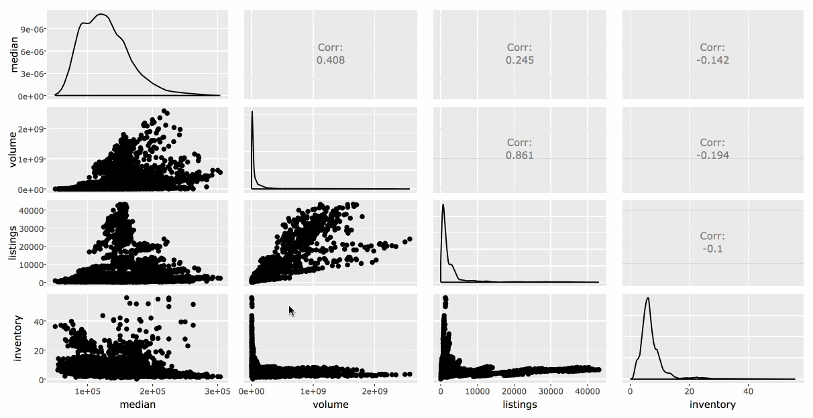
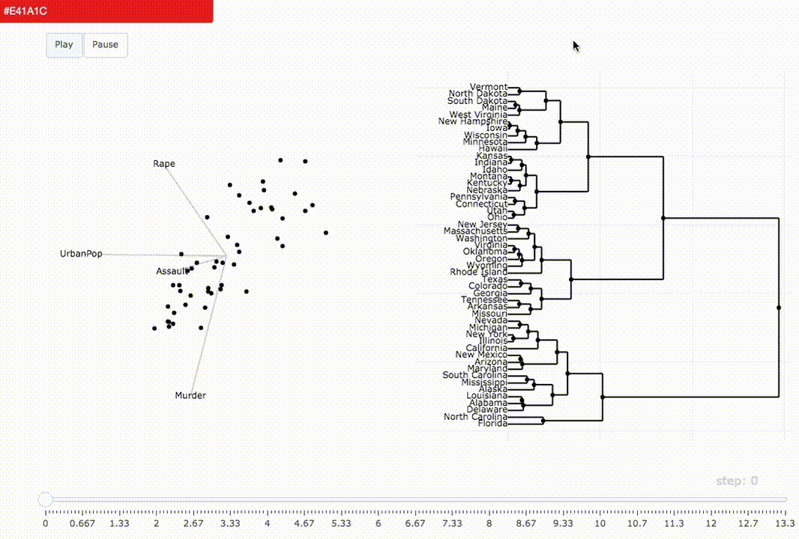
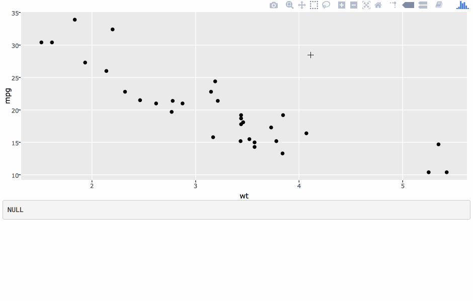
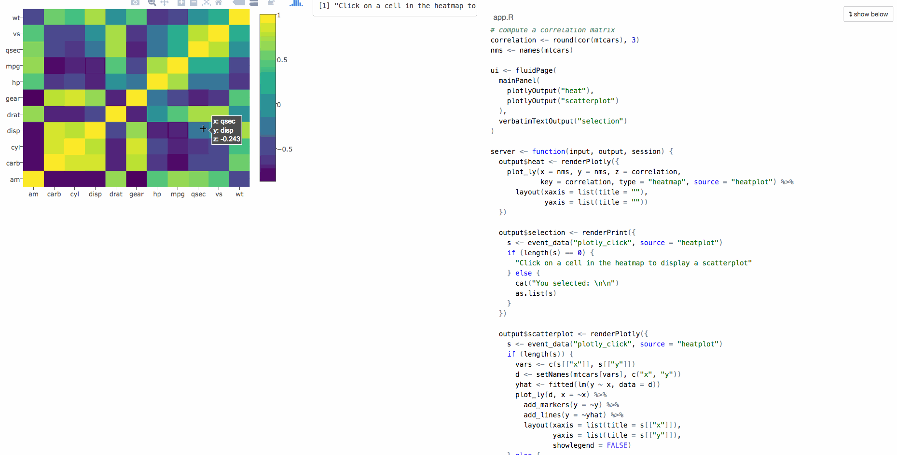

```{r, include = FALSE}
knitr::opts_chunk$set(
  message = FALSE,
  fig.width = 10,
  fig.height = 4,
  comment = "#>",
  collapse = TRUE,
  eval = FALSE
)
```

## Monthly housing sales

```{r, eval = TRUE}
library(plotly)
txhousing
```


---


## Abilene monthly sales

```{r}
Abilene <- subset(txhousing, city == "Abilene")
p <- ggplot(Abilene, aes(month, sales, group = year)) + 
  geom_line()
ggplotly(p, dynamicTicks = "x")
```

<iframe src="01.html" width="100%" height="420" scrolling="no" seamless="seamless" frameBorder="0"> </iframe>

---


## Abilene monthly sales, animated by year

```{r}
p <- ggplot(Abilene, aes(month, sales, frame = year)) + 
  geom_line()
ggplotly(p)
```

<iframe src="02.html" width="100%" height="420" scrolling="no" seamless="seamless" frameBorder="0"> </iframe>


---


## Animations are layer specific

```{r}
p <- ggplot(Abilene, aes(month, sales)) + 
  geom_line(aes(group = year), alpha = 0.2) +
  geom_line(aes(frame = year), color = "red")
ggplotly(p)
```

<iframe src="04.html" width="100%" height="420" scrolling="no" seamless="seamless" frameBorder="0"> </iframe>

---


## Easily change animation options

```{r}
animation_opts(
  ggplotly(p), frame = 1000, easing = "elastic"
)
```

<iframe src="05.html" width="100%" height="420" scrolling="no" seamless="seamless" frameBorder="0"> </iframe>

---


## Easily change button appearance

```{r}
animation_button(
   ggplotly(p), x = 1, xanchor = "right", y = 1, yanchor = "middle"
)
```

<iframe src="06.html" width="100%" height="420" scrolling="no" seamless="seamless" frameBorder="0"> </iframe>

---


## Easily change slider appearance

```{r}
animation_slider(
   ggplotly(p), currentvalue = list(prefix = "YEAR ", font = list(color = "red"))
)
```

<iframe src="07.html" width="100%" height="420" scrolling="no" seamless="seamless" frameBorder="0"> </iframe>

---
class: center, bottom
background-image: url(hans-rosling.jpg)
background-size: contain


## Gapminder data

---

```{r}
data(gapminder, package = "gapminder")
gg <- ggplot(gapminder, aes(gdpPercap, lifeExp, color = continent, size = pop)) +
  geom_point(alpha = 0.1) +
  geom_point(aes(frame = year, ids = country)) +
  scale_x_log10()
ggplotly(gg) %>% animation_opts(1000, redraw = FALSE)
```

<iframe src="07b.html" width="100%" height="500" scrolling="no" seamless="seamless" frameBorder="0"> </iframe>

---
class: inverse, center
background-image: url(../your-turn.jpeg)
background-size: contain


## Your Turn

Read through [this thread](https://github.com/ropensci/plotly/issues/957). Can you take what is there to make a *cumulative* animation of the gapminder data?

**Hint**: Use `geom_path()` over `geom_point()`

.footnote[
PS. hopefully we will have more official solution someday.

Solution is [here](01-your-turn.R)
]

---
class: middle, center, inverse


# Highlighting (i.e., brushing) in multiple linked views 

---


## Highlighting via crosstalk

```{r}
library(crosstalk)
d <- SharedData$new(Abilene, ~year)
p <- ggplot(d, aes(month, sales)) +
  geom_line(aes(group = year))
ggplotly(p, tooltip = "year")
```

<iframe src="08.html" width="100%" height="420" scrolling="no" seamless="seamless" frameBorder="0"> </iframe>

---


## Highlighting in small multiples

```{r}
d <- subset(txhousing, city %in% c("Galveston", "Midland", "Odessa", "South Padre Island"))
sd <- SharedData$new(d, ~year)
p <- ggplot(sd, aes(month, median, group = year)) + geom_line() +
  facet_wrap(~city, ncol = 2)
(gg <- ggplotly(p, tooltip = "year"))
```

<iframe src="09.html" width="100%" height="420" scrolling="no" seamless="seamless" frameBorder="0"> </iframe>

---


## Or in a scatterplot matrix

```{r}
txhousing %>% 
  select(median, volume, listings, inventory) %>% 
  GGally::ggpairs() %>% ggplotly() %>% highlight("plotly_selected")
```

<a href="09a.html">
  <div align="center">
    
  </div>
</a>

---


## Highlight on hover

```{r}
highlight(gg, "plotly_hover")
```

<iframe src="09b.html" width="100%" height="500" scrolling="no" seamless="seamless" frameBorder="0"> </iframe>

---


## Set default values

```{r}
highlight(gg, defaultValues = "2006")
```

<iframe src="09c.html" width="100%" height="500" scrolling="no" seamless="seamless" frameBorder="0"> </iframe>

---


## Making comparisons with dynamic brush

```{r}
highlight(
  gg, dynamic = TRUE, persistent = TRUE, selectize = TRUE
)
```

<iframe src="10.html" width="100%" height="420" scrolling="no" seamless="seamless" frameBorder="0"> </iframe>

---


## Customize the appearance of selections

```{r}
highlight(
  gg, dynamic = TRUE, persistent = TRUE, 
  selected = attrs_selected(mode = "markers+lines", marker = list(symbol = "x"))
)
```

<iframe src="11.html" width="100%" height="420" scrolling="no" seamless="seamless" frameBorder="0"> </iframe>

---


## m-to-n linking

```{r}
demo("crosstalk-highlight-pipeline", package = "plotly")
```

<iframe src="11b.html" width="100%" height="500" scrolling="no" seamless="seamless" frameBorder="0"> </iframe>

---
class: inverse, center
background-image: url(../your-turn.jpeg)
background-size: contain


## Your turn

(1) Modify [the last demo](https://github.com/ropensci/plotly/blob/master/demo/crosstalk-highlight-pipeline.R) to have persistent and dynamic selection. Try supplying your own custom color palette.

(2) Read the code. Change `add_bars()` to `add_markers()`. How in the world does this work?


---
class: bottom, left 
background-image: url(pipeline.svg)
background-size: contain


## The 'data pipeline'

Where does the pipeline <br /> 'live'?


---
background-image: url(crosstalk.svg)
background-size: contain


## The general model

.footnote[
All the "updating logic" is self-contained in your browser via JavaScript, making it easier to share, host, and likely more performant -- http://rpubs.com/cpsievert/204407
]

---


## Binning (i.e., transforming) the target

```{r}
demo("crosstalk-highlight-binned-target", package = "plotly")
```

<iframe src="11c.html" width="100%" height="480" scrolling="no" seamless="seamless" frameBorder="0"> </iframe>

---


## Binning (i.e., transforming) the target

```{r}
demo("crosstalk-highlight-binned-target", package = "plotly")
```

<iframe src="11d.html" width="100%" height="525" scrolling="no" seamless="seamless" frameBorder="0"> </iframe>

---
class: inverse, center, middle


# You can only go so far without shiny...

---
class: bottom
background-image: url(zikar.gif)
background-size: contain

### https://github.com/cpsievert/zikar

---
class: bottom
background-image: url(eechidna.gif)
background-size: contain

### https://github.com/ropenscilabs/eechidna

---
class: center, middle
background-image: url(combine-powers.gif)
background-size: contain

# ...but we can combine powers

---
class: bottom
background-image: url(bcviz.gif)
background-size: contain

### https://github.com/cpsievert/bcviz

---
class: center, middle


# I promise...

We will get to shiny, but we can do *much* more *without* shiny<sup>1</sup>

---


## Animating selections

```{r}
a <- SharedData$new(Abilene, ~month)
p <- ggplot(a, aes(month, sales, frame = year)) + 
  geom_line() + geom_point()
highlight(ggplotly(p), "plotly_selected")
```

<iframe src="13.html" width="100%" height="420" scrolling="no" seamless="seamless" frameBorder="0"> </iframe>

---


## Avoid overplotting

```{r}
g <- SharedData$new(gapminder, ~continent)
gg <- ggplot(g, aes(gdpPercap, lifeExp, color = continent, frame = year)) +
  geom_point(aes(size = pop, ids = country)) +
  geom_smooth(se = FALSE, method = "lm") 
ggplotly(gg + scale_x_log10())
```

<iframe src="14.html" width="100%" height="420" scrolling="no" seamless="seamless" frameBorder="0"> </iframe>

---


```{r}
demo("animation-tour-USArrests", package = "plotly")
```

<a href="15.html" target="_blank" >
  
</a>

---
class: inverse, middle, center


# Filter vs selection

The `highlight()` function provides ways to handle/configure *selection* events

You can also trigger *filter* events through **crosstalk** widgets.

They are similar, but axes respond (i.e., relayout) to *filter* events.<sup>1</sup>

.footnote[
[1]: when using `ggplotly()`, you need to specify `dynamicTicks = TRUE`
]

---


## Crosstalk's filtering widgets

```{r}
tx <- SharedData$new(txhousing)
widgets <- bscols(widths = c(12, 12, 12),
  filter_select("city", "Cities", tx, ~city),
  filter_slider("sales", "Sales", tx, ~sales),
  filter_checkbox("year", "Years", tx, ~year, inline = TRUE)
)
widgets
```

<iframe src="crosstalk/1/index.html" width="100%" height="420" scrolling="no" seamless="seamless" frameBorder="0"> </iframe>

---


## Filtering

```{r}
bscols(
  widths = c(4, 8), widgets, 
  plot_ly(tx, x = ~date, y = ~median, showlegend = FALSE) %>% 
    add_lines(color = ~city, colors = "black")
)
```

<iframe src="crosstalk/2/index.html" width="100%" height="420" scrolling="no" seamless="seamless" frameBorder="0"> </iframe>


---


## Talk to other crosstalk-enabled widgets

```{r}
library(leaflet)
sd <- SharedData$new(quakes)
p <- plot_ly(sd, x = ~depth, y = ~mag) %>% add_markers(alpha = 0.5) %>% highlight("plotly_selected")
map <- leaflet(sd) %>% addTiles() %>% addCircles()
bscols(p, map)
```

<iframe src="leaflet/index.html" width="100%" height="420" scrolling="no" seamless="seamless" frameBorder="0"> </iframe>


---
class: inverse, center
background-image: url(../your-turn.jpeg)
background-size: contain


## Your Turn

Add some filter widgets to the earthquakes example.

**Bonus**: Try saving the result to an HTML file.

**Hint**: You can save htmlwidgets to a self-contained HTML via `htmlwidgets::saveWidget()`, but this approach requires the more general `htmltools::save_html()`

.footnote[
Solution is [here](02-your-turn.R)
]

---
class: center, middle, inverse


## Expectations vs reality

.pull-left[
  
]

.pull-right[
<br />
<br />
<br />
<br />

  **plotly** has advanced support for *selection* events (e.g., `persistent`, `dynamic`, `selectize`)

  Other [**crosstalk**-enabled htmlwidgets](https://rstudio.github.io/crosstalk/) likely won't support these additional *selection* event features.
  
  However, *filter* events should generally be supported.
]

---


## Shiny is a web application framework

Web applications are generally more powerful and flexible; but also more complicated, less responsive, and difficult to share.

<div align="center" >
  
</div>

**Remember**: examples so far can saved as _self-contained_ HTML via `htmlwidgets::saveWidget()` and/or `htmltools::save_html()` 

---


## [Accessing user events](events-shiny.R) in shiny

<div align="center" >
  
</div>

This functionality is tied to `plotOutput()`, which doesn't support web-based graphics.

---


## [Accessing plotly events](events-plotly.R) in shiny


<div align="center" >
  
</div>

---
class: inverse, center
background-image: url(../your-turn.jpeg)
background-size: contain


## Your Turn

Program an app to populate a bar chart reflecting the selection, sort of like this (using `cars` data):

<div align="center" >
  
</div>

.footnote[
[Full solution](https://github.com/ropensci/plotly/blob/master/inst/examples/shiny/event_data_select/app.R)

[Partial solution, <br /> without shiny](03-your-turn.R)
]


---


## [Targeting events](events-plotly.R)


<div align="center" >
  
</div>

---


## In summary

* Use the `frame` aesthetic to create animations
    * Use `animation_opts()` to control speed/transition.
    * Use `animation_button()` to remove/customize play button
    * Use `animation_slider()` to remove/customise slider
   
* Use `SharedData` from **crosstalk** to enable highlight/filter
    * Use `highlight()` to control whether brush/click/hover event triggers highlighting
    * Use `highlight()` to enable persitent/dynamic selection -- useful for making comparisons
    * 
    
* Use `event_data()` to access/use plotly events in shiny

---
class: center, middle


# Thanks!

Resources for more learning:

https://plotly-book.cpsievert.me/ <br />
https://plot.ly/r/ <br />
https://talks.cpsievert.me/ <br />
https://github.com/cpsievert/phd-thesis <br />
https://github.com/cpsievert/pedestrians <br />
https://github.com/cpsievert/bcviz <br />
https://github.com/cpsievert/shiny_apps <br />

Reach out to me

Twitter: [@cpsievert](https://twitter.com/cpsievert) <br />
GitHub: [@cpsievert](https://github.com/cpsievert) <br />
Email: <cpsievert1@gmail.com> <br />
Web: <https://cpsievert.me/>