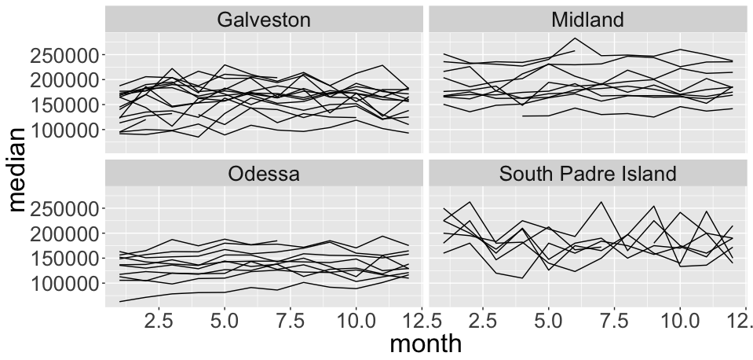
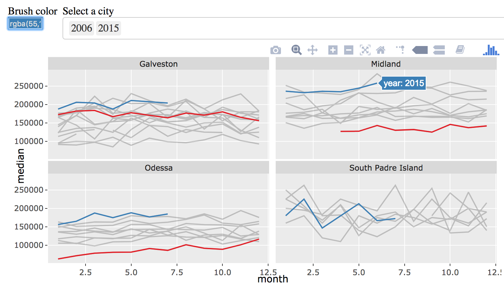
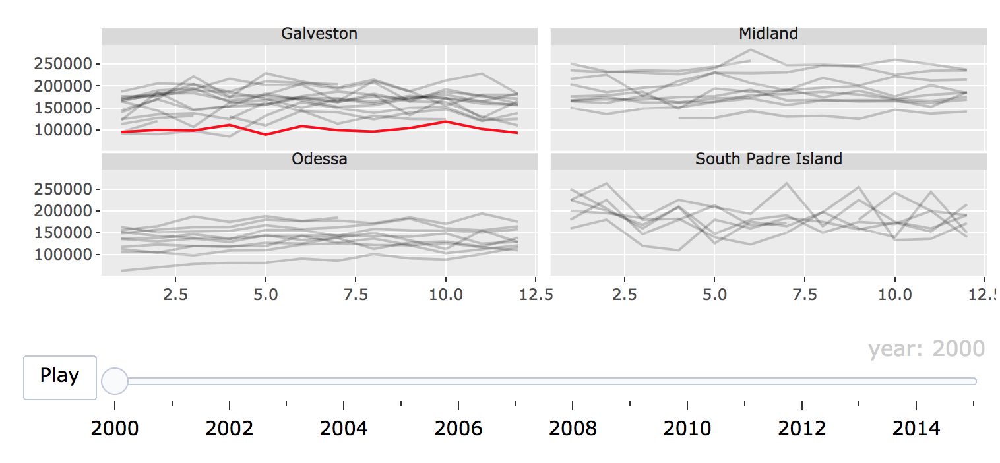

class: bottom, left
background-image: url(plotly-for-r.svg)
background-size: contain

# Welcome

## Thanks for coming!

<style>
.principles {
  font-size: 150%;
}
</style>

---
class: inverse, middle, principles
background-image: url(your-turn.jpeg)
background-size: contain

<h2 align="center"> Your turn </h2>

Open the slides <https://bit.ly/useR18>

Go to this address <https://rstudio.cloud/project/14090>. Follow the directions you see in the 'hello.R' script.


.footnote[
---
Time: 5 minutes
]


---
class: middle

<h3 align="center"> About me </h3>

* PhD in statistics at Iowa State with Heike Hofmann & Di Cook (Dec 2016) 
  
  * Thesis: [Interfacing R with web technologies](http://lib.dr.iastate.edu/etd/15422/)
  
* CEO of [Sievert Consulting](https://consulting.cpsievert.me/) LLC (Jan 2017)

  * Clients: plotly, NOAA, Sandia Labs, O'Reilly
  
* I `r emo::ji("heart")` interactive data visualization
  
  * Maintain/author R `r emo::ji("package")`s: plotly, LDAvis, animint

```{r, include = FALSE}
library(plotly)
knitr::opts_chunk$set(
  eval = FALSE,
  message = FALSE,
  warning = FALSE,
  comment = "#>",
  collapse = TRUE,
  fig.width = 12,
  fig.height = 6
)
```

---
background-image: url(workflow.svg)
background-size: contain
class: inverse

# Data science workflow


---
background-image: url(workflow1.svg)
background-size: contain
class: inverse

## Web graphics are great for presentation!

<br />
<br />
<br />
<br />
<br />
<br />
<br />
<br />
<br />
<br />
<br />
<br />
<br />
<br />
<br />

### Sharable, portable, composable (i.e., reports, dashboards, etc)


---
background-image: url(workflow2.svg)
background-size: contain
class: inverse

## Web technologies aren't designed for this iteration!

<br />
<br />
<br />
<br />
<br />
<br />
<br />
<br />
<br />
<br />
<br />
<br />
<br />
<br />
<br />
<br />

### Follow-up questions (ignited through visualization) may rely on sophisticated computations

---
class: principles

## ...but interactivity augments exploration

* Identify structure that otherwise goes missing ([Tukey 1972](http://stat-graphics.org/movies/prim9.html)).
    
* Search for information quickly without fully specified questions<sup>1</sup> ([Unwin & Hofmann, 2000](https://www.researchgate.net/publication/2425912_GUI_and_Command-line_-_Conflict_or_Synergy))
    * Multiple linked views are the optimal framework for posing queries about data ([Buja, Cook, & Swayne 1996](https://www.jstor.org/stable/1390754))
    
* Diagnose, compare, and understand models ([Wickham, Cook, & Hofmann 2015](http://onlinelibrary.wiley.com/doi/10.1002/sam.11271/abstract)).

.footnote[
---

[1]: Worried about inference? See visual ([Majumder et al 2013](http://amstat.tandfonline.com/doi/abs/10.1080/01621459.2013.808157?journalCode=uasa20#.Wl01_ZM-dTY)) and post-selection ([Berk et al 2013](https://projecteuclid.org/euclid.aos/1369836961)) inference frameworks.
]


---
background-image: url(workflow2.svg)
background-size: 400px
background-position: 90% 8%
class: inverse, middle, center

## Interactive graphics can <font color="red">augment exploratory analysis</font>, but are only practical when we can <font color="red">iterate quickly</font>

---
background-image: url(workflow1.svg)
background-size: 400px
background-position: 90% 8%
class: inverse, middle, center

## Interactive graphics can <font color="red">enhance presentation</font>, but are only practical when <font color="red">easily distributed</font>

---
background-image: url(server-client.svg)
background-size: contain
class: middle, right

# When is a web application necessary?

---
background-image: url(server-client-dim.svg)
background-size: contain
class: middle, right

# Easier to share, scale, and maintain

---
background-image: url(server-client-dim.svg)
background-size: contain
class: middle, right

# What can plotly do in a standalone page?

---
## An example of (standalone) linked views

<iframe src="txmissing.html" width="100%" height="485" scrolling="no" seamless="seamless" frameBorder="0"> </iframe>

---
background-image: url(pipeline.svg)
background-size: contain
class: bottom, left 

## "Linking as a <br> database query"

---
class: middle, inverse

<h2 align="center"> Not everything can be (reasonably) framed as a database query!</h2>

.footnote[
#### But a suprising amount can! 
]

---
class: inverse, middle, principles
background-image: url(your-turn.jpeg)
background-size: contain

<h2 align="center"> Your Turn </h2>

Think of a question you'd like to answer using familiar data. Think of a (linked) graphic that could help address the question (bonus: draw it)!

.footnote[
---

Time: 5 minutes

Feel free to introduce me to your personal projects!
]


---
## Texas housing prices

```{r echo = FALSE, eval = FALSE}
data(txhousing, package = "ggplot2")
tx <- txhousing %>%
  select(city, year, month, median) %>%
  filter(city %in% c("Galveston", "Midland", "Odessa", "South Padre Island"))
```

```r
tx
```

```r
#> # A tibble: 748 x 4
#>    city       year month median
#>    <chr>     <int> <int>  <dbl>
#>  1 Galveston  2000     1  95000
#>  2 Galveston  2000     2 100000
#>  3 Galveston  2000     3  98300
#>  4 Galveston  2000     4 111100
#>  5 Galveston  2000     5  89200
#>  6 Galveston  2000     6 108600
#>  7 Galveston  2000     7  99000
#>  8 Galveston  2000     8  96200
#>  9 Galveston  2000     9 104000
#> 10 Galveston  2000    10 118800
#> # ... with 738 more rows
```

#### Can month help explain (median) price?

---
### Price versus month

```r
library(ggplot2)
ggplot(tx, aes(month, median, group = year)) +
  geom_line() +
  facet_wrap(~city, ncol = 2)
```

<div align="center">
  
</div>

---
### Query specific years

```r
library(plotly)
*TX <- highlight_key(tx, ~year)
p <- ggplot(TX, aes(month, median, group = year)) + geom_line() +
  facet_wrap(~city, ncol = 2)
*ggplotly(p, tooltip = "year")
```

<a href="08-small-multiples.html" target="_blank">
<div align="center">
  
</div>
</a>

---
## Set selection mode and default selections

```r
highlight(.Last.value, "plotly_hover", defaultValues = "2006")
```

<a href="08-modes.html" target="_blank">
<div align="center">
  
</div>
</a>


---
## Make comparisons with dynamic brush

```{r}
highlight(.Last.value, dynamic = TRUE, persistent = TRUE, selectize = TRUE)
```

<a href="08-dynamic.html" target="_blank">
<div align="center">
  
</div>
</a>

---
## Customize the appearance of selections

```r
highlight(
  .Last.value, dynamic = TRUE, persistent = TRUE, 
*  selected = attrs_selected(mode = "markers+lines", marker = list(symbol = "x"))
)
```

<a href="08-custom.html" target="_blank">
  <div align="center">
    
  </div>
</a>

---
## Automate queries via animation

```r
p <- ggplot(tx, aes(month, median)) + 
  geom_line(aes(group = year), alpha = 0.2) +
*  geom_line(aes(frame = year), color = "red") +
  facet_wrap(~city, ncol = 2)
ggplotly(p)
```

<a href="08-automate.html" target="_blank">
<div align="center">
  
</div>
</a>

---
class: middle, inverse
background-image: url(../gifs/epl-compare.gif)
background-size: contain

# Generally useful for comparing within/across panels!

---
class: inverse, middle, principles
background-image: url(your-turn.jpeg)
background-size: contain

<h2 align="center"> Your Turn </h2>

Run the following R code:

```r
demo("crosstalk-highlight-epl-2", package = "plotly")
```

This generates the soccer visualization. Compare the performance of 'Liverpool' with 'Chelsea'. What other info can you extract from this graphic?

<hr>

Time: 5 minutes
