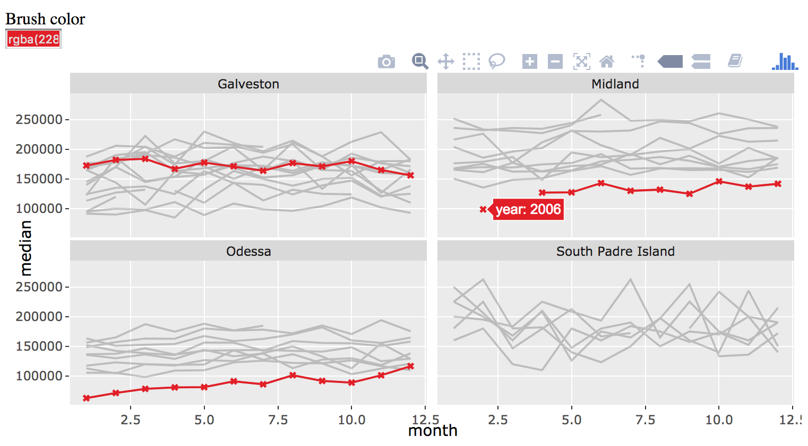

class: inverse, middle, principles
background-image: url(your-turn.jpeg)
background-size: contain

<h2 align="center"> Your Turn </h2>

### Point your web browser to [bit.ly/r-pharma](https://bit.ly/r-pharma)

### (These are the slides for the tutorial)

---
background-image: url(workflow.svg)
background-size: contain
class: inverse

<style>
.principles {
  font-size: 150%;
}
</style>


# Data science workflow


---
background-image: url(workflow1.svg)
background-size: contain
class: inverse

## Web graphics are great for expository viz!

<br />
<br />
<br />
<br />
<br />
<br />
<br />
<br />
<br />
<br />
<br />
<br />
<br />
<br />
<br />

### Sharable, portable, composable (i.e., reports, dashboards, etc)


---
background-image: url(workflow2.svg)
background-size: contain
class: inverse

### Interactive graphics are great for exploration<sup>1</sup>, <br /> &nbsp; &nbsp; &nbsp; &nbsp; &nbsp; ...but web technologies are <i>not</i> practical for EDA


.footnote[
#### 1: And have been for many decades!  <http://stat-graphics.org/movies/>
]

---
background-image: url(../gifs/why-not-both.gif)
background-size: contain
class: inverse

---
background-image: url(../gifs/why-not-both-r.gif)
background-size: contain
class: inverse

---
class: inverse, middle

<h2 align="center"> What's required for both?</h2>

.pull-left[

## Rapid iteration with extensibility & reproducibility


]

.pull-right[
## Simple, scalable, and secure hosting


]

<br />
<br />

[See more](https://talks.cpsievert.me/20171207) of more thoughts on what makes a great exploratory/expository tools

---
background-image: url(server-client.svg)
background-size: contain
class: middle, right

# When is a web application necessary?

---
background-image: url(server-client-dim.svg)
background-size: contain
class: middle, right

# Easier to share, scale, and maintain

---
background-image: url(server-client-dim.svg)
background-size: contain
class: middle, right

# Client-side technologies: HTML, JavaScript, CSS

---
background-image: url(server-client-dim.svg)
background-size: contain
class: middle, right

# DYK: Many R packages generate HTML/JavaScript...

.footnote[
...via **htmlwidgets** and **htmltools**
]

---
background-image: url(server-client-dim.svg)
background-size: contain
class: middle, right

# plotly can do a lot in a standalone page!

---
class: middle, principles, inverse

<h2 align="center"> plotly's client-side reactivity options </h2>

1. Graphical (database) queries
  * In _plotly for R_, I call this [linking views without shiny](https://plotly-book.cpsievert.me/linking-views-without-shiny.html).
  
2. Respond to plotly [sliders](https://plot.ly/r/sliders/), [buttons](https://plot.ly/r/custom-buttons/), and [dropdowns](https://plot.ly/r/dropdowns/) via [plotly.js functions](https://plot.ly/javascript/plotlyjs-function-reference/)

3. Custom JavaScript via `htmlwidgets::onRender()`
  * Respond to [plotly.js events](https://plot.ly/javascript/plotlyjs-events/) in a custom way
  
  
---
class: middle, principles, inverse

<h2 align="center"> plotly's client-side reactivity options </h2>


1. __Graphical (database) queries__
  * __In _plotly for R_, I call this [linking views without shiny](https://plotly-book.cpsievert.me/linking-views-without-shiny.html).__
  
2. Respond to plotly [sliders](https://plot.ly/r/sliders/), [buttons](https://plot.ly/r/custom-buttons/), and [dropdowns](https://plot.ly/r/dropdowns/) via [plotly.js functions](https://plot.ly/javascript/plotlyjs-function-reference/)

3. Custom JavaScript via `htmlwidgets::onRender()`
  * Respond to [plotly.js events](https://plot.ly/javascript/plotlyjs-events/) in a custom way

---
### Make ggplot2 interactive

```{r, include = FALSE}
library(plotly)
knitr::opts_chunk$set(
  eval = FALSE,
  message = FALSE,
  warning = FALSE,
  comment = "#>",
  collapse = TRUE,
  fig.width = 12,
  fig.height = 6
)
```

```r
library(plotly)
p <- ggplot(txhousing) + geom_line(aes(date, median, group = city))
ggplotly(p)
```

<iframe src="txbasic.html" width="100%" height="650" scrolling="no" seamless="seamless" frameBorder="0"> </iframe>

---
### Customize tooltip

```r
library(plotly)
p <- ggplot(txhousing) + geom_line(aes(date, median, group = city, text = city))
ggplotly(p, tooltip = "text")
```

<iframe src="txtooltip.html" width="100%" height="650" scrolling="no" seamless="seamless" frameBorder="0"> </iframe>

---
### Highlight a key (e.g. city) column

```r
library(plotly)
*tx <- highlight_key(txhousing, ~city)
p <- ggplot(tx) + geom_line(aes(date, median, group = city, text = city))
gg <- ggplotly(p, tooltip = "text")
*highlight(gg, on = "plotly_click")
```

<iframe src="txhighlight.html" width="100%" height="650" scrolling="no" seamless="seamless" frameBorder="0"> </iframe>

---
### Direct/indirect manipulation & persistent highlighting!

```r
gg <- ggplotly(p, tooltip = "text")
*highlight(gg, on = "plotly_hover", selectize = TRUE, dynamic = TRUE)
```

<iframe src="txmodes.html" width="100%" height="450" scrolling="no" seamless="seamless" frameBorder="0"> </iframe>

---
### Link aggregates to raw data

<iframe src="txmissing.html" width="100%" height="650" scrolling="no" seamless="seamless" frameBorder="0"> </iframe>

---
background-image: url(pipeline.svg)
background-size: contain
class: bottom, left 

## "Linking as a <br> database query"

---
background-image: url(pipeline.svg)
background-size: contain
class: bottom, left 

.pull-left[
```sql
SELECT * FROM table 
  WHERE city == "South Padre Island"
```
]

---
background-image: url(crosstalk.svg)
background-size: contain

# R -> JavaScript/HTML

.footnote[
### Querying is handled by JavaScript -- no web server running R required! 
]

---
class: inverse
background-image: url(printing.svg)
background-size: contain

---
## Inspect the underlying JSON

`plotly_json()` returns the underlying JSON of any **plotly** graph, see [my blog post](http://blog.cpsievert.me/2018/01/30/learning-improving-ggplotly-geom-sf/) for more.

<iframe src="json.html" width="100%" height="550" scrolling="no" seamless="seamless" frameBorder="0"> </iframe>

---
class: inverse, middle, principles
background-image: url(your-turn.jpeg)
background-size: contain

<h2 align="center"> Your Turn </h2>

### Which of the following graphics use this "graphical database query" framework?

---
background-image: url(../gifs/storms.gif)
background-size: contain

### Linking 2D with 3D

---
background-image: url(../gifs/mapbox-aggregates.gif)
background-size: contain

### Linking mapbox with bar chart

---
background-image: url(../gifs/dt-trails.gif)
background-size: contain

### Linking mapbox with DT

---
background-image: url(../gifs/zikar.gif)
background-size: contain

### Linking bounding box to density estimate

---
background-image: url(../gifs/us-arrests.gif)
background-size: contain
class: middle, left

### Linking dendogram to grand tour

---
class: inverse, middle, principles
background-image: url(your-turn.jpeg)
background-size: contain

<h2 align="center"> Your Turn </h2>

(A) One of the following is not supported by the "graphical database query" framework, which is it?

* Linking 2D with 3D
* Linking mapbox with bar chart
* Linking mapbox with DT
* Linking bounding box to density estimate
* Linking dendogram to grand tour

(B) Think of a question you could ask of *your* data via the framework.

.footnote[
---

Time: 5 minutes
]


---
## Texas housing prices

```r
tx <- txhousing %>%
  select(city, year, month, median) %>%
  filter(city %in% c("Galveston", "Midland", "Odessa", "South Padre Island"))
```

```r
#> # A tibble: 748 x 4
#>    city       year month median
#>    <chr>     <int> <int>  <dbl>
#>  1 Galveston  2000     1  95000
#>  2 Galveston  2000     2 100000
#>  3 Galveston  2000     3  98300
#>  4 Galveston  2000     4 111100
#>  5 Galveston  2000     5  89200
#>  6 Galveston  2000     6 108600
#>  7 Galveston  2000     7  99000
#>  8 Galveston  2000     8  96200
#>  9 Galveston  2000     9 104000
#> 10 Galveston  2000    10 118800
#> # ... with 738 more rows
```

#### How does price differ across these 4 cities?

---
### Price versus month, by city & year

```r
library(ggplot2)
ggplot(tx, aes(month, median, group = year)) +
  geom_line() +
  facet_wrap(~city, ncol = 2)
```

<div align="center">
  
</div>

---
### Query specific years

```r
library(plotly)
*TX <- highlight_key(tx, ~year)
p <- ggplot(TX, aes(month, median, group = year)) + geom_line() +
  facet_wrap(~city, ncol = 2)
*ggplotly(p, tooltip = "year")
```

<a href="08-small-multiples.html" target="_blank">
<div align="center">
  
</div>
</a>

---
## Set selection mode and default selections

```r
highlight(.Last.value, on = "plotly_hover", defaultValues = 2006)
```

<a href="08-modes.html" target="_blank">
<div align="center">
  
</div>
</a>


---
## Make comparisons with dynamic brush

```{r}
highlight(.Last.value, dynamic = TRUE, persistent = TRUE, selectize = TRUE)
```

<a href="08-dynamic.html" target="_blank">
<div align="center">
  
</div>
</a>

---
## Customize the appearance of selections

```r
highlight(
  .Last.value, dynamic = TRUE, persistent = TRUE, 
*  selected = attrs_selected(mode = "markers+lines", marker = list(symbol = "x"))
)
```

<a href="08-custom.html" target="_blank">
  <div align="center">
    
  </div>
</a>

---
## Automate queries via animation

```r
p <- ggplot(tx, aes(month, median)) + 
  geom_line(aes(group = year), alpha = 0.2) +
*  geom_line(aes(frame = year), color = "red") +
  facet_wrap(~city, ncol = 2)
ggplotly(p)
```

<a href="08-automate.html" target="_blank">
<div align="center">
  
</div>
</a>

---
class: middle, inverse
background-image: url(../gifs/epl-compare.gif)
background-size: contain

# Generally useful for comparing within/across panels!

.footnote[
[interactive](epl.html)
]


---
## Aggregating selections

<iframe src="02-binned-target-a.html" width="100%" height="550" scrolling="no" seamless="seamless" frameBorder="0"> </iframe>

---
class: principles

```r
library(plotly)
d <- highlight_key(mpg)

dots <- plot_ly(d, color = ~class) %>% 
  add_markers(x = ~displ, y = ~cyl)
boxs <- plot_ly(d, color = ~class) %>% 
  add_boxplot(x = ~class, y = ~cty)
bars <- plot_ly(d, color = ~class) %>% 
  add_histogram(x = ~class)

subplot(dots, boxs, titleX = TRUE, titleY = TRUE) %>%
  subplot(bars, nrows = 2, titleX = TRUE, titleY = TRUE) %>%
  layout(barmode = "overlay") %>%
  highlight("plotly_selected")
```

---
## Aggregating selections (continued)

<iframe src="02-binned-target-b.html" width="100%" height="400" scrolling="no" seamless="seamless" frameBorder="0"> </iframe>

---

```r
library(plotly)
d <- highlight_key(mtcars)
sp <- plot_ly(d, x = ~mpg, y = ~disp) %>% 
  add_markers(color = I("black"))

# 'statistical trace types'
hist <- plot_ly(d, x = ~factor(cyl)) %>% add_histogram(color = I("black"))
box <- plot_ly(d, y = ~disp, color = I("black")) %>% add_boxplot(name = " ")
violin <- plot_ly(d, y = ~disp, color = I("black")) %>% add_violin(name = " ")

subplot(sp, box, violin, shareY = TRUE) %>%
  subplot(hist, widths = c(.75, .25)) %>%
  layout(
    barmode = "overlay", 
    title = "Click and drag scatterplot"
  ) %>%
  highlight("plotly_selected")
```


---
## Aggregating selections (continued)

<iframe src="02-binned-target-c.html" width="100%" height="500" scrolling="no" seamless="seamless" frameBorder="0"> </iframe>

---

```r
library(plotly)
tx <- highlight_key(txhousing, ~city)

p1 <- ggplot(tx, aes(date, median, group = city)) + geom_line()
gg1 <- ggplotly(p1, tooltip = c("city", "date", "median"))
p2 <- plot_ly(tx, x = ~median, color = I("black")) %>% 
  add_histogram(histnorm = "probability density")

subplot(gg1, p2, titleX = TRUE, titleY = TRUE) %>% 
  layout(barmode = "overlay") %>%
  highlight(dynamic = TRUE, selected = attrs_selected(opacity = 0.3))
```


---
## Talk with other htmlwidgets

```{r, code=readLines("05-leaflet.R")}
```

<iframe src="05-leaflet.html" width="100%" height="420" scrolling="no" seamless="seamless" frameBorder="0"> </iframe>

---
### Linking plotly with DT

```r
library(plotly)
data(trails, package = "mapview")
tsd <- highlight_key(trails)
crosstalk::bscols(
  plot_mapbox(tsd, text = ~FKN, hoverinfo = "text"),
  DT::datatable(tsd)
)
```

<iframe src="05-DT.html" width="100%" height="420" scrolling="no" seamless="seamless" frameBorder="0"> </iframe>

---
class: center, middle, inverse

## Expectations vs reality

.pull-left[
  
]

.pull-right[
<br />
<br />
<br />
<br />

  **plotly** has advanced support for *highlight* events (e.g., `persistent`, `dynamic`, `selectize`)

  Other [**crosstalk**-enabled htmlwidgets](https://rstudio.github.io/crosstalk/) likely won't respect (non-default) `highlight()` options.
  
  However, *filter* events should generally be supported.
]

---
class: middle, center, principles

# Filter vs highlight

*Highlight* events **dim the opacity** of existing marks.

*Filter* events **completely removes** existing marks and rescales axes.

At least currently, *filter* events must be fired from **crosstalk** widgets.

---
background-image: url(../gifs/filter-vs-highlight.gif)
background-size: contain


---
## Crosstalk's filtering widgets

```{r}
library(crosstalk)
tx <- highlight_key(txhousing)
widgets <- bscols(
  widths = c(12, 12, 12),
  filter_select("city", "Cities", tx, ~city),
  filter_slider("sales", "Sales", tx, ~sales),
  filter_checkbox("year", "Years", tx, ~year, inline = TRUE)
)
widgets
```

<iframe src="03-filter-widgets.html" width="100%" height="420" scrolling="no" seamless="seamless" frameBorder="0"> </iframe>

---
## Filtering

```{r}
bscols(
  widths = c(4, 8), widgets, 
  plot_ly(tx, x = ~date, y = ~median, showlegend = FALSE) %>% 
    add_lines(color = ~city, colors = "black")
)
```

<iframe src="04-filter.html" width="100%" height="420" scrolling="no" seamless="seamless" frameBorder="0"> </iframe>

---
class: middle, principles, inverse

<h2 align="center"> plotly's client-side reactivity options </h2>

1. Graphical (database) queries
  * In _plotly for R_, I call this [linking views without shiny](https://plotly-book.cpsievert.me/linking-views-without-shiny.html).
  
2. __Respond to plotly [sliders](https://plot.ly/r/sliders/), [buttons](https://plot.ly/r/custom-buttons/), and [dropdowns](https://plot.ly/r/dropdowns/) via [plotly.js functions](https://plot.ly/javascript/plotlyjs-function-reference/)__

3. Custom JavaScript via `htmlwidgets::onRender()`
  * Respond to [plotly.js events](https://plot.ly/javascript/plotlyjs-events/) in a custom way
  
  
---
## Dropdown example

<iframe src="dropdown.html" width="100%" height="500" scrolling="no" seamless="seamless" frameBorder="0"> </iframe>

---
## The implementation

```r
styles <- schema()$layout$layoutAttributes$mapbox$style$values
style_buttons <- lapply(styles, function(s) {
  list(label = s, method = "relayout", args = list("mapbox.style", s))
})

storms <- sf::st_read(system.file("shape/storms_xyz.shp", package = "sf"), quiet = TRUE)
plot_mapbox(storms, color = I("red")) %>%
  layout(
    title = "Changing the base layer",
    updatemenus = list(list(y = 0.8, buttons = style_buttons))
  )
```

---
class: middle, principles, inverse

<h2 align="center"> plotly's client-side reactivity options </h2>

1. Graphical (database) queries
  * In _plotly for R_, I call this [linking views without shiny](https://plotly-book.cpsievert.me/linking-views-without-shiny.html).
  
2. Respond to plotly [sliders](https://plot.ly/r/sliders/), [buttons](https://plot.ly/r/custom-buttons/), and [dropdowns](https://plot.ly/r/dropdowns/) via [plotly.js functions](https://plot.ly/javascript/plotlyjs-function-reference/)

3. __Custom JavaScript via `htmlwidgets::onRender()`__
  * __Respond to [plotly.js events](https://plot.ly/javascript/plotlyjs-events/) in a custom way__
  
---
### Google search on click

The `customdata` attribute provides a way to attach "meta-data" to visual attributes that you can access with JavaScript. See [here](https://github.com/ropensci/plotly/blob/master/demo/custom-javascript.R) for more examples.

```r
plot_ly(mtcars, x = ~wt, y = ~mpg) %>%
  add_markers(customdata = ~paste0("http://google.com/#q=", rownames(mtcars))) %>%
  htmlwidgets::onRender("function(el, x) {
    el.on('plotly_click', function(d) {
      var url = d.points[0].customdata;
      window.open(url);
    });
  }")
```

<iframe src="google.html" width="100%" height="300" scrolling="no" seamless="seamless" frameBorder="0"> </iframe>

---
class: middle, center

# Thanks!

Resources for more learning:

https://plotly-book.cpsievert.me <br />
https://blog.cpsievert.me <br />
https://talks.cpsievert.me <br />
https://github.com/cpsievert/apps <br />
https://github.com/cpsievert/pedestrians <br />
https://github.com/cpsievert/bcviz <br />
https://github.com/cpsievert/phd-thesis <br />

Find me online:

Web: <http://cpsievert.me/> <br />
Twitter: [@cpsievert](https://twitter.com/cpsievert) <br />
GitHub: [@cpsievert](https://github.com/cpsievert) <br />
Email: <cpsievert1@gmail.com>