background-image: url(your-turn.jpeg)
background-size: contain
class: inverse, principles

<style>
.principles {
  font-size: 150%;
}
</style>

```{r, include = FALSE}
library(plotly)
library(countdown)
knitr::opts_chunk$set(
  eval = FALSE,
  message = FALSE,
  warning = FALSE,
  comment = "#>",
  collapse = TRUE,
  fig.width = 12,
  fig.height = 6
)
include_vimeo <- function(id, width = "100%", height = "400") {
  url <- sprintf("https://player.vimeo.com/video/%s?title=0&byline=0&portrait=0", id)
  htmltools::tags$iframe(
    src = url,
    width = width,
    height = height,
    frameborder = "0",
    seamless = "seamless",
    webkitAllowFullScreen = NA,
    mozallowfullscreen = NA,
    allowFullScreen = NA
  )
}
```

<h2 align="center"> Your turn </h2>

(1) Open the slides **in Firefox**:  [bit.ly/R_Pharma](https://bit.ly/R_Pharma)

<br/>

(2) Go to this address <https://rstudio.cloud/project/446255>. This hosted RStudio instance contains materials for today's workshop.
  * Login or sign up to RStudio Cloud (it's free)
  * Click "Save a Permanent Copy" to copy the project to your account.

<br/>

(3) Ask me any question at any time by going to [slido.com](https://www.sli.do) and enter event code #8464 (or use [this link](https://app.sli.do/event/7ev3yywn)). I'll try to check these questions periodically (upvote questions if you'd like them answered!)

```{r, echo=FALSE, eval = TRUE}
countdown(minutes = 5, seconds = 0, bottom = 0, color_background = "black")
```

---
## A minimal bar chart

* Every **plotly** chart is powered by [plotly.js](https://github.com/plotly/plotly.js), *plus some extra R/JS magic* `r emo::ji("tophat")` `r emo::ji("rabbit")`.
* `plot_ly()` is designed to give more "R-like" defaults

```{r}
library(plotly)
plot_ly(x = c("A", "B"), y = c(1, 2))
```

<div align="center">
  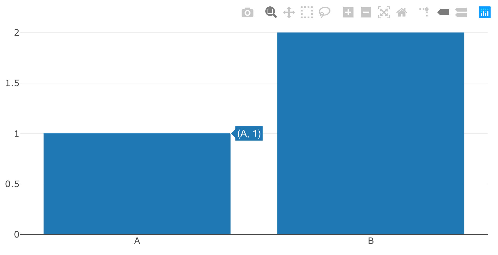
</div>

What actually happens when a plotly object is printed and rendered locally?

---
class: inverse
background-image: url(printing.svg)
background-size: contain

---
## Plotly figures are JSON

A Plotly *figure* is made up of trace(s) and a layout. A *trace* is a mapping from data to visual.

.pull-left[
```js
var trace1 = {
  x: ['giraffes', 'orangutans', 'monkeys'],
  y: [20, 14, 23],
  name: 'SF Zoo',
  type: 'bar'
};

var trace2 = {
  x: ['giraffes', 'orangutans', 'monkeys'],
  y: [12, 18, 29],
  name: 'LA Zoo',
  type: 'bar'
};

var data = [trace1, trace2];

Plotly.newPlot('myDiv', data);
```
]

.pull-right[
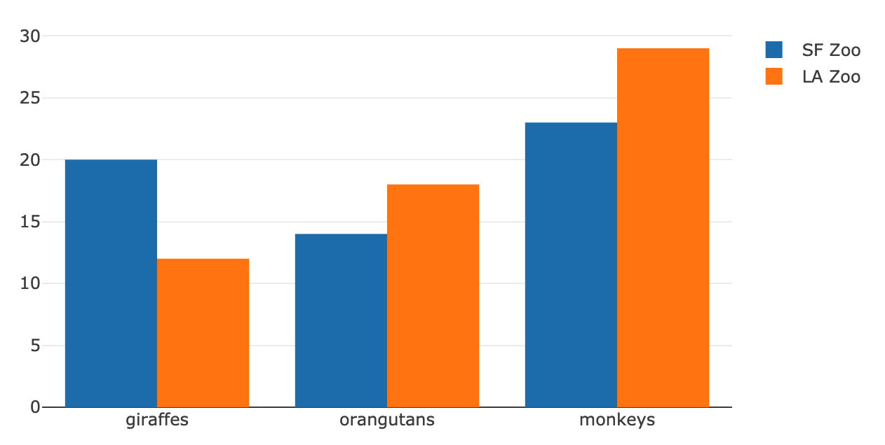
]

---
## Now in R, with `plot_ly()`

In R, use `plot_ly()` (or `ggplotly()`) to create a **plotly** object, then `add_trace()` to add any trace you want.

.pull-left[
```r
plot_ly() %>%
  add_trace(
    x = c('giraffes', 'orangutans', 'monkeys'),
    y = c(20, 14, 23),
    name = 'SF Zoo',
    type = 'bar'
  ) %>%
  add_trace(
    x = c('giraffes', 'orangutans', 'monkeys'),
    y = c(12, 18, 29),
    name = 'LA Zoo',
    type = 'bar'
  )
```
]

.pull-right[

]

---
## `plot_ly()` syntax

Use `~` to reference a data column

.pull-left[
```r
zoo_dat <- tibble::tibble(
  animal = rep(c('giraffes', 'orangutans', 'monkeys'), 2),
  count = c(20, 14, 23, 12, 18, 29),
  zoo = rep(c('SF Zoo', 'LA Zoo'), each = 3)
)
zoo_dat
#> # A tibble: 6 x 3
#>   animal     count zoo   
#>   <chr>      <dbl> <chr> 
#> 1 giraffes      20 SF Zoo
#> 2 orangutans    14 SF Zoo
#> 3 monkeys       23 SF Zoo
#> 4 giraffes      12 LA Zoo
#> 5 orangutans    18 LA Zoo
#> 6 monkeys       29 LA Zoo
```
]

.pull-right[
```r
plot_ly(zoo_dat) %>%
  add_trace(
*   x = ~animal,
*   y = ~count,
*   name = ~zoo,
    type = "bar"
  )
```


]

---
## `plot_ly()` syntax

For attributes that require a scalar value (e.g. `name`), `plot_ly()` generates one trace per level.

.pull-left[
```r
zoo_dat <- tibble::tibble(
  animal = rep(c('giraffes', 'orangutans', 'monkeys'), 2),
  count = c(20, 14, 23, 12, 18, 29),
  zoo = rep(c('SF Zoo', 'LA Zoo'), each = 3)
)
zoo_dat
#> # A tibble: 6 x 3
#>   animal     count zoo   
#>   <chr>      <dbl> <chr> 
#> 1 giraffes      20 SF Zoo
#> 2 orangutans    14 SF Zoo
#> 3 monkeys       23 SF Zoo
#> 4 giraffes      12 LA Zoo
#> 5 orangutans    18 LA Zoo
#> 6 monkeys       29 LA Zoo
```
]

.pull-right[
```r
plot_ly(zoo_dat) %>%
  add_trace(
    x = ~animal,
    y = ~count,
*   name = ~zoo,
    type = "bar"
  )
```


]

---
## `plot_ly()` syntax

The `split` argument is a more explicit way to split data into multiple traces

.pull-left[
```r
zoo_dat <- tibble::tibble(
  animal = rep(c('giraffes', 'orangutans', 'monkeys'), 2),
  count = c(20, 14, 23, 12, 18, 29),
  zoo = rep(c('SF Zoo', 'LA Zoo'), each = 3)
)
zoo_dat
#> # A tibble: 6 x 3
#>   animal     count zoo   
#>   <chr>      <dbl> <chr> 
#> 1 giraffes      20 SF Zoo
#> 2 orangutans    14 SF Zoo
#> 3 monkeys       23 SF Zoo
#> 4 giraffes      12 LA Zoo
#> 5 orangutans    18 LA Zoo
#> 6 monkeys       29 LA Zoo
```
]

.pull-right[
```r
plot_ly(zoo_dat) %>%
  add_trace(
    x = ~animal,
    y = ~count,
*   split = ~zoo,
    type = "bar"
  )
```


]


---
## `plotly_json()` to view underlying JSON

.pull-left[
```r
zoo_dat <- tibble::tibble(
  animal = rep(c('giraffes', 'orangutans', 'monkeys'), 2),
  count = c(20, 14, 23, 12, 18, 29),
  zoo = rep(c('SF Zoo', 'LA Zoo'), each = 3)
)
zoo_dat
#> # A tibble: 6 x 3
#>   animal     count zoo   
#>   <chr>      <dbl> <chr> 
#> 1 giraffes      20 SF Zoo
#> 2 orangutans    14 SF Zoo
#> 3 monkeys       23 SF Zoo
#> 4 giraffes      12 LA Zoo
#> 5 orangutans    18 LA Zoo
#> 6 monkeys       29 LA Zoo
```
]

.pull-right[
```r
plot_ly(zoo_dat) %>%
  add_trace(
    x = ~animal,
    y = ~count,
    name = ~zoo,
    type = "bar"
  ) %>%
*  # Verify we get one trace per zoo  
*  plotly_json(FALSE)
```

```json
"data": [
  {
    "x": ["giraffes", "orangutans", "monkeys"],
    "y": [12, 18, 29],
    "name": "LA Zoo",
    "type": "bar"
  }, {
    "x": ["giraffes", "orangutans", "monkeys"],
    "y": [20, 14, 23],
    "name": "SF Zoo",
    "type": "bar"
  }
]
```
]


---
## `plot_ly()` syntax

More common trace types have a dedicated "layer" function (e.g., `add_bars()`).

.pull-left[
```r
zoo_dat <- tibble::tibble(
  animal = rep(c('giraffes', 'orangutans', 'monkeys'), 2),
  count = c(20, 14, 23, 12, 18, 29),
  zoo = rep(c('SF Zoo', 'LA Zoo'), each = 3)
)
zoo_dat
#> # A tibble: 6 x 3
#>   animal     count zoo   
#>   <chr>      <dbl> <chr> 
#> 1 giraffes      20 SF Zoo
#> 2 orangutans    14 SF Zoo
#> 3 monkeys       23 SF Zoo
#> 4 giraffes      12 LA Zoo
#> 5 orangutans    18 LA Zoo
#> 6 monkeys       29 LA Zoo
```
]

.pull-right[
```r
plot_ly(zoo_dat) %>%
* add_bars(
    x = ~animal,
    y = ~count,
    name = ~zoo
  )
```


]

---
## `plot_ly()` syntax

Discrete axis ordering: use factor levels (character strings appear alphabetically)

.pull-left[
```r
zoo_dat <- tibble::tibble(
  animal = rep(c('giraffes', 'orangutans', 'monkeys'), 2),
  count = c(20, 14, 23, 12, 18, 29),
  zoo = rep(c('SF Zoo', 'LA Zoo'), each = 3)
)
zoo_dat
#> # A tibble: 6 x 3
#>   animal     count zoo   
#>   <chr>      <dbl> <chr> 
#> 1 giraffes      20 SF Zoo
#> 2 orangutans    14 SF Zoo
#> 3 monkeys       23 SF Zoo
#> 4 giraffes      12 LA Zoo
#> 5 orangutans    18 LA Zoo
#> 6 monkeys       29 LA Zoo
```
]

.pull-right[
```r
plot_ly(zoo_dat) %>%
  add_bars(
*   x = ~factor(animal, c("monkeys", "giraffes", "orangutans")),
    y = ~count,
    name = ~zoo
  )
```

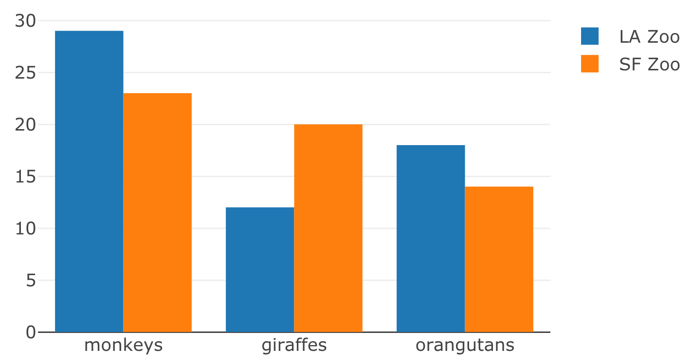
]


---
## `plot_ly()` color mapping

Mapping data to `color` will impose it's own color scheme

.pull-left[
```r
zoo_dat <- tibble::tibble(
  animal = rep(c('giraffes', 'orangutans', 'monkeys'), 2),
  count = c(20, 14, 23, 12, 18, 29),
  zoo = rep(c('SF Zoo', 'LA Zoo'), each = 3)
)
zoo_dat
#> # A tibble: 6 x 3
#>   animal     count zoo   
#>   <chr>      <dbl> <chr> 
#> 1 giraffes      20 SF Zoo
#> 2 orangutans    14 SF Zoo
#> 3 monkeys       23 SF Zoo
#> 4 giraffes      12 LA Zoo
#> 5 orangutans    18 LA Zoo
#> 6 monkeys       29 LA Zoo
```
]

.pull-right[
```r
plot_ly(zoo_dat) %>%
  add_bars(
    x = ~animal,
    y = ~count,
*   color = ~zoo
  )
```
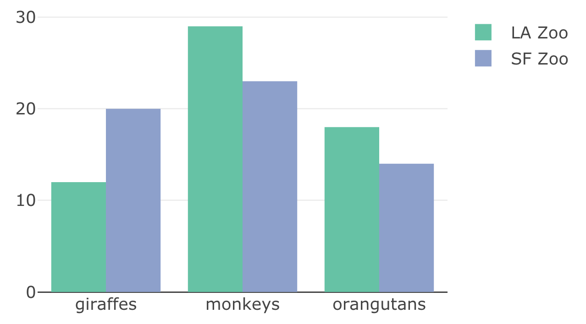
]


---
## `plot_ly()` color mapping

Specify the range via `colors` (here a [colorbrewer](http://colorbrewer2.org) palette name, see `RColorBrewer::brewer.pal.info` for options)

.pull-left[
```r
zoo_dat <- tibble::tibble(
  animal = rep(c('giraffes', 'orangutans', 'monkeys'), 2),
  count = c(20, 14, 23, 12, 18, 29),
  zoo = rep(c('SF Zoo', 'LA Zoo'), each = 3)
)
zoo_dat
#> # A tibble: 6 x 3
#>   animal     count zoo   
#>   <chr>      <dbl> <chr> 
#> 1 giraffes      20 SF Zoo
#> 2 orangutans    14 SF Zoo
#> 3 monkeys       23 SF Zoo
#> 4 giraffes      12 LA Zoo
#> 5 orangutans    18 LA Zoo
#> 6 monkeys       29 LA Zoo
```
]

.pull-right[
```r
plot_ly(zoo_dat) %>%
  add_bars(
    x = ~animal,
    y = ~count,
*   color = ~zoo,
*   colors = "Accent"
  )
```
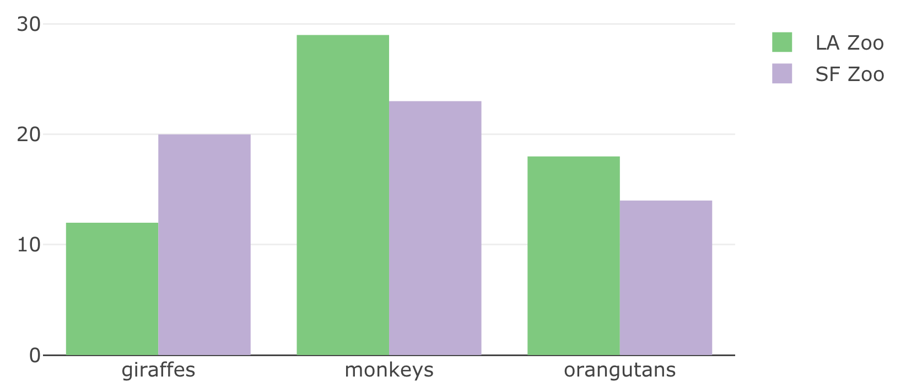
]


---
## `plot_ly()` color mapping

Provide your own palette if you want. See `?plot_ly` for more details.

.pull-left[
```r
zoo_dat <- tibble::tibble(
  animal = rep(c('giraffes', 'orangutans', 'monkeys'), 2),
  count = c(20, 14, 23, 12, 18, 29),
  zoo = rep(c('SF Zoo', 'LA Zoo'), each = 3)
)
zoo_dat
#> # A tibble: 6 x 3
#>   animal     count zoo   
#>   <chr>      <dbl> <chr> 
#> 1 giraffes      20 SF Zoo
#> 2 orangutans    14 SF Zoo
#> 3 monkeys       23 SF Zoo
#> 4 giraffes      12 LA Zoo
#> 5 orangutans    18 LA Zoo
#> 6 monkeys       29 LA Zoo
```
]

.pull-right[
```r
plot_ly(zoo_dat) %>%
  add_bars(
    x = ~animal,
    y = ~count,
*   color = ~zoo,
*   colors = c(
*     "SF Zoo" = "black", 
*     "LA Zoo" = "red"
*   )
  )
```
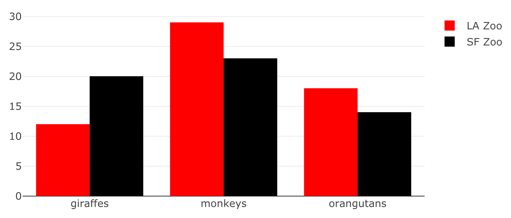
]

---
## `plot_ly()` syntax

Use `color`/`colors` for fill-color and `stroke`/`strokes` for outline-color

.pull-left[
```r
zoo_dat <- tibble::tibble(
  animal = rep(c('giraffes', 'orangutans', 'monkeys'), 2),
  count = c(20, 14, 23, 12, 18, 29),
  zoo = rep(c('SF Zoo', 'LA Zoo'), each = 3)
)
zoo_dat
#> # A tibble: 6 x 3
#>   animal     count zoo   
#>   <chr>      <dbl> <chr> 
#> 1 giraffes      20 SF Zoo
#> 2 orangutans    14 SF Zoo
#> 3 monkeys       23 SF Zoo
#> 4 giraffes      12 LA Zoo
#> 5 orangutans    18 LA Zoo
#> 6 monkeys       29 LA Zoo
```
]

.pull-right[
```r
plot_ly(zoo_dat) %>%
  add_bars(
    x = ~animal,
    y = ~count,
    split = ~zoo,
*   stroke = ~zoo,
*   strokes = c(
*     "SF Zoo" = "black", 
*     "LA Zoo" = "red"
*   )
  )
```
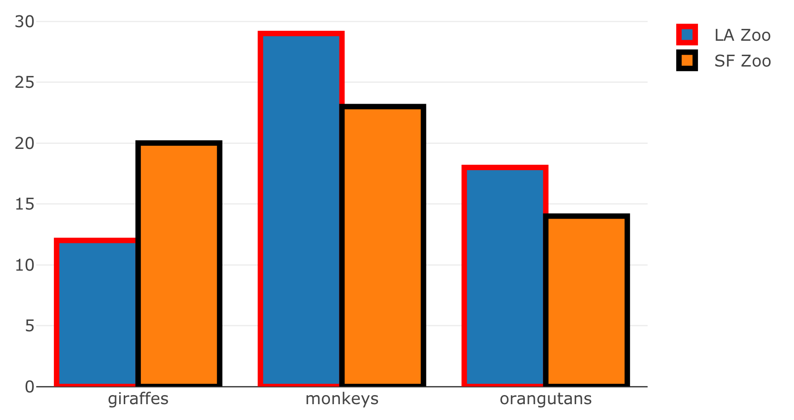
]


---
background-image: url(your-turn.jpeg)
background-size: contain
class: inverse

## Your turn

.pull-left[
```r
zoo_dat <- tibble::tibble(
  animal = rep(c('giraffes', 'orangutans', 'monkeys'), 2),
  count = c(20, 14, 23, 12, 18, 29),
  zoo = rep(c('SF Zoo', 'LA Zoo'), each = 3)
)
zoo_dat
#> # A tibble: 6 x 3
#>   animal     count zoo   
#>   <chr>      <dbl> <chr> 
#> 1 giraffes      20 SF Zoo
#> 2 orangutans    14 SF Zoo
#> 3 monkeys       23 SF Zoo
#> 4 giraffes      12 LA Zoo
#> 5 orangutans    18 LA Zoo
#> 6 monkeys       29 LA Zoo
```
]

.pull-right[
```r
plot_ly(zoo_dat) %>%
  add_bars(
    x = ~animal,
    y = ~count,
    color = ~zoo,
    stroke = "black",
    span = I(5)
  )
```

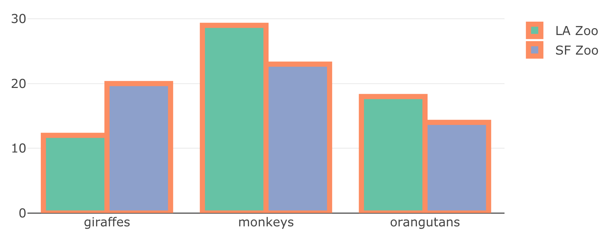
]

1. What does the `span` argument control? 
2. Can you make the `span` be a function of `count`?
3. Why isn't the `stroke` on this plot black?

```{r, echo=FALSE, eval = TRUE}
countdown(minutes = 5, seconds = 0, bottom = 0, color_background = "black")
```

---
## Getting help

.pull-left[
#### Documentation

* How-to guide: [plot.ly/r](https://plot.ly/r)
* R user guide: [plotly-r.com](https://plotly-r.com)
* R documentation: [rdocumentation.org](https://rdocumentation.org)
]

.pull-right[
#### Q&A

* Plotly+Shiny+R related questions: [community.rstudio.com](https://community.rstudio.com)
* Plotly.js specific questions: [community.plot.ly](https://community.plot.ly)
* Another option: [stackoverflow.com](https://stackoverflow.com)
]

#### Debugging, in general

* Use `plotly_json()` to inspect the underlying JSON
  * Especially useful for debugging things that _map to_ plotly.js (e.g., `color`, `stroke`, `ggplotly()`).
  
* `plotly_json()` should align with the figure reference https://plot.ly/javascript/reference

* The online figure reference doesn't always reflect the version of plotly.js used in the R package, but `schema()` does!


---
## `plotly_json()`: focus on `data` and `layout`

```r
# If no plot is provided, it shows JSON of the previously printed plot
plotly_json()
```

<iframe src="plotly-json.html" width="100%" height="400" id="igraph" scrolling="no" seamless="seamless" frameBorder="0"> </iframe>

---
### `plotly_json()` should align with plotly.js' `schema()`

* `?plot_ly` documents R-specific arguments (e.g., `color`, `stroke`, etc). 
* `schema()` documents the actual plotly.js attributes (e.g., `marker.color`, `marker.line.color`, etc).

<iframe src="schema.html" width="120%" height="450" id="igraph" scrolling="no" seamless="seamless" frameBorder="0"> </iframe>

---
## Useful for finding plotly.js features

.pull-left[
 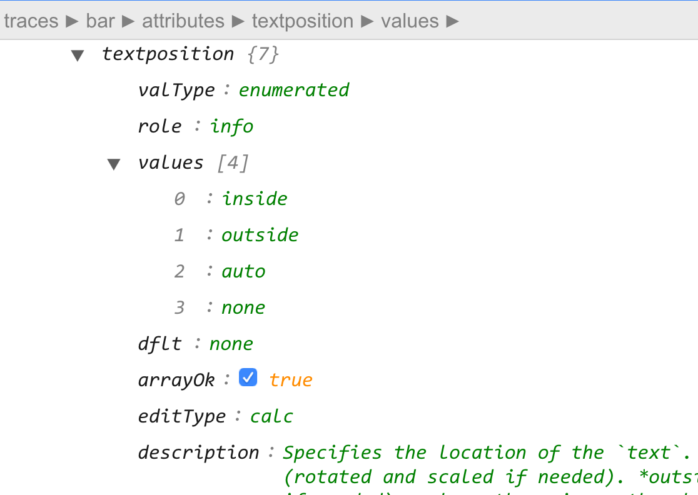
]

.pull-right[
```r
plot_ly(zoo_dat) %>%
  add_bars(
    x = ~animal,
    y = ~count,
*   text = ~count,
*   textposition = "auto",
    split = ~zoo,
    stroke = I("black")
  )
```
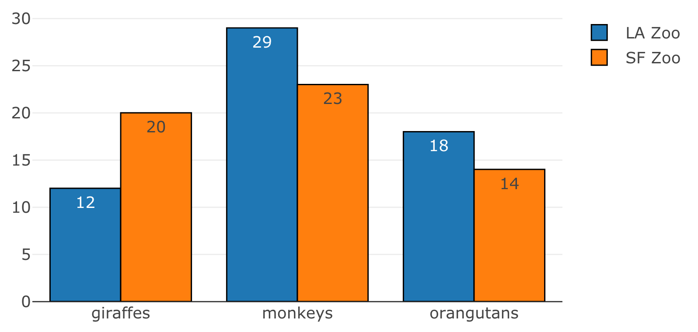
]

---
### Also useful for learning about `layout()` & `config()`

.pull-left[
```r
plot_ly() %>%
  layout(
    xaxis = list(range = c(-5, 5)),
    yaxis = list(range = c(-5, 5)),
    annotations = list(
      text = "Drag the rect",
      x = 0.5, xref = "paper",
      y = 0.5, yref = "paper"
    ),
    # shapes types: rect, circle, line
    shapes = list(
      type = "rect",
      x0 = 0, x1 = 1, 
      y0 = 0, y1 = -1,
      fillcolor = "blue"
    )
  ) %>%
  # Two lesser known gems: editable & displayModeBar
  config(
    editable = TRUE,
    displayModeBar = FALSE
  )
```
]

.pull-right[
<iframe src="editable.html" width="110%" height="550" id="igraph" scrolling="no" seamless="seamless" frameBorder="0"> </iframe>
]

---
## A practical example of editable charts

```{r, echo = FALSE, eval = TRUE}
include_vimeo("309371928")
```

Later on, we'll see some cool ways to leverage edit events in Shiny.  

---
## Various R/plotly stuff that we don't have time to cover

Too much to list, but here's a start!

* Saving **plotly** graphs as html, pdf, svg, png, etc.
  * https://plotly-r.com/saving.html
* Convert **ggplot2** to **plotly** with `ggplotly()`
  * https://plotly-r.com/overview.html#intro-ggplotly
  * https://plotly-r.com/improving-ggplotly.html
* First-class support for **sf** objects
  * https://plotly-r.com/maps.html
* Arranging multiple **plotly** objects in a single view
  * https://plotly-r.com/arranging-views.html
* Animation
  * https://plotly-r.com/animating-views.html
* Event handling in JavaScript
  * https://plotly-r.com/javascript.html
* Linking views client-side 
  * https://plotly-r.com/client-side-linking.html

<hr/>

### The remainder of the workshop fits under [linking views *server-side* with Shiny](https://plotly-r.com/linking-views-with-shiny.html)

---
background-image: url(openfda-logo.png)
background-size: contain
class: bottom

## Case study: drug reaction outcomes


---

`drug_outcomes()` acquires reaction outcomes for a given drug name

```r
library(openfda) # remotes::install_github("ropenhealth/openfda")
library(dplyr)
drug_outcomes <- function(name) {
  fda_query("/drug/event.json") %>%
    fda_filter("patient.drug.openfda.generic_name", name) %>%
    fda_count("patient.reaction.reactionoutcome") %>%
    fda_exec() %>%
    mutate(reaction = recode(term,
        `1` = "Recovered/resolved",
        `2` = "Recovering/resolving",
        `3` = "Not recovered/not resolved",
        `4` = "Recovered/resolved with sequelae",
        `5` = "Fatal", `6` = "Unknown")) 
}
drug_outcomes("fentanyl")
#>   term count                         reaction
#> 1    5 31515                            Fatal
#> 2    6 30624                          Unknown
#> 3    1 14641               Recovered/resolved
#> 4    3 13691       Not recovered/not resolved
#> 5    2  4248             Recovering/resolving
#> 6    4   406 Recovered/resolved with sequelae
```

---

### Visualizing outcomes for a few drugs

.pull-left[
```r
drugs <- c(
  "fentanyl", 
  "oxycodone", 
  "morphine"
)

lapply(drugs, drug_outcomes) %>%
  setNames(drugs) %>%
  bind_rows(.id = "drug") %>%
  plot_ly(
    y = ~reaction, 
    x = ~count, 
    color = ~drug
  ) %>%
  add_bars()
```
]

.pull-right[
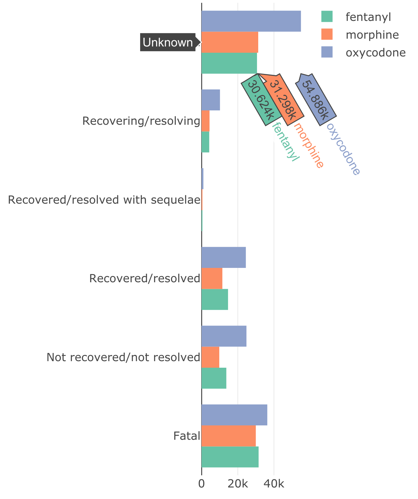
]

---
## Same data, different look

.pull-left[

]
.pull-right[
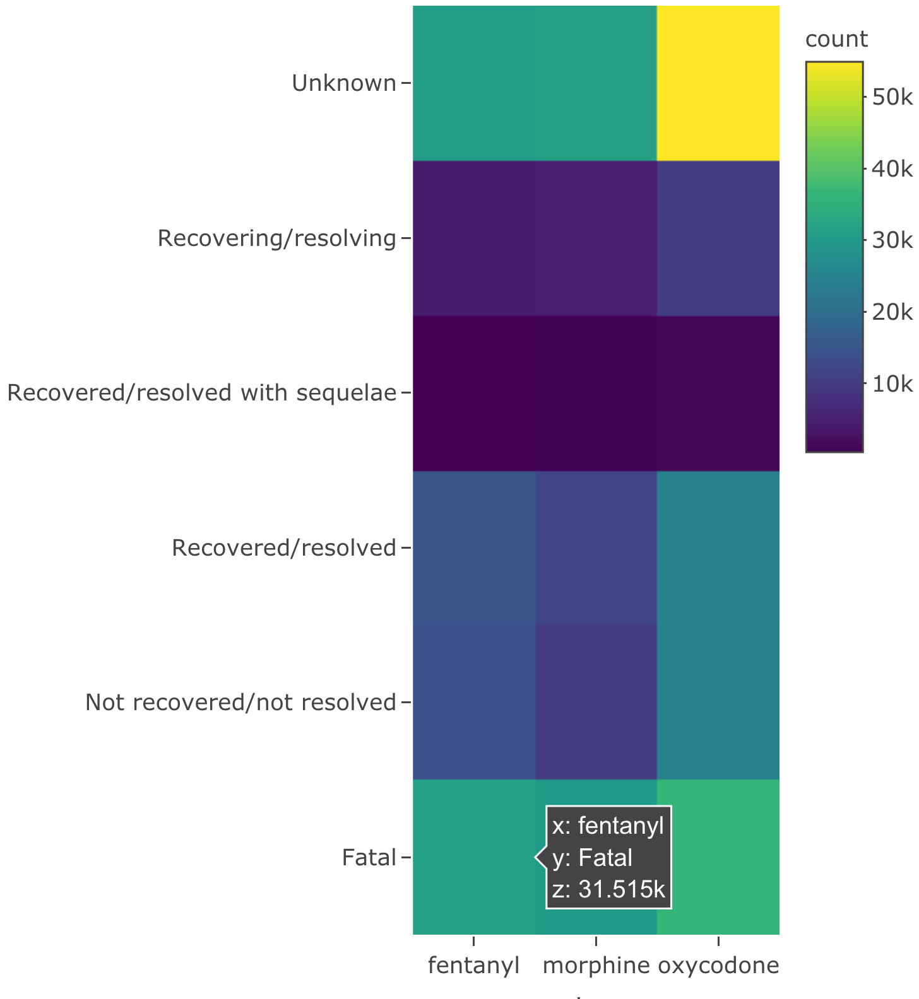
]

---
### Heatmap of 1000 drug outcomes (made with heatmaply and plotly)

```{r, echo = FALSE, eval = TRUE}
include_vimeo("285132666")
```

Not only is the visual technique more scalable, but with [**heatmaply**](https://cran.r-project.org/web/packages/heatmaply/vignettes/heatmaply.html), it's easy to reorder columns so that "similar" drugs next to each other. 

---
### Bi-plot of 1000 drug outcomes (made with shiny and plotly)

```{r, echo = FALSE, eval = TRUE}
include_vimeo("353646796")
```

---
class: center, middle, inverse

# Overview first, then zoom and filter, then details on demand 

Ben Shneiderman

.footnote[
Sound advice for any high-dimensional datavis problem
]

---
class: inverse

## The end goal

* What follows is a series of exercises that build up to this linked scatterplot + bar chart functionality

<div align="center">
  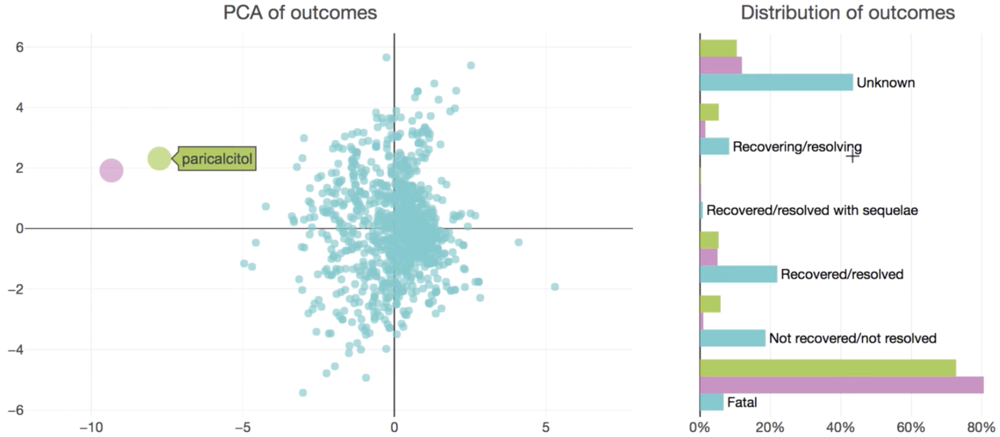
</div>

* Along the way, we'll learn generally useful techniques for linking multiple views with **shiny**+**plotly** (read more at https://plotly-r.com/linking-views-with-shiny.html)
    * [Accessing user events](https://plotly-r.com/linking-views-with-shiny.html#shiny-plotly-inputs)
    * [Managing event data](https://plotly-r.com/linking-views-with-shiny.html#reactive-vals)
    * [Improving performance](https://plotly-r.com/linking-views-with-shiny.html#shiny-performance)

---

## Hello Shiny

Here's an Shiny app with a **plotly** graph that updates in response to a dropdown:

```r
file.edit("shiny/00/app.R")
shiny::runApp("shiny/00")
```

---

## Hello user input

Many **htmlwidget** packages allow you to listen to user interaction with the widget. Just to name a few, **plotly**, **leaflet**, and **DT** all have this functionality. Here's a simple **DT** example:


```r
file.edit("shiny/01/app.R")
shiny::runApp("shiny/01")
```


---
background-image: url(your-turn.jpeg)
background-size: contain
class: inverse

<h2 align="center"> Your Turn: Responding to click events </h2>

The following Shiny app shows how to access click events tied to the scatterplot. 

```r
file.edit("shiny/02/app.R")
shiny::runApp("shiny/02")
```

Follow the "Your Turn" directions to extend the functionality of this app (to see the "solution", run `shiny::runApp("shiny/02-solution")`)

```{r, echo = FALSE, eval = TRUE}
countdown(minutes = 5, seconds = 0, bottom = 0, color_background = "black")
```

---
# Hello reactive values

The following Shiny app prints the time difference between button clicks to the R console.

```r
file.edit("shiny/03/app.R")
shiny::runApp("shiny/03")
```

Note that: 

* In order to compute the difference, Shiny needs to 'remember' the time the last click occurred (`reactiveVal()` provides mechanism for doing so).
* Reactive values are very similar to input values -- when their value changes, it 'invalidates' any code that depends on it.


---
background-image: url(your-turn.jpeg)
background-size: contain
class: inverse

<h2 align="center"> Your Turn: Managing event data </h2>

The following Shiny app shows how to accumulate (i.e., track the history) of click events

```r
file.edit("shiny/04/app.R")
shiny::runApp("shiny/04")
```

Follow the "Your Turn" directions to extend the functionality of this app. There are many ways to go about this, so there are two "solutions".

```{r, echo = FALSE, eval = TRUE}
countdown(minutes = 5, seconds = 0, bottom = 0, color_background = "black")
```

---
background-image: url(your-turn.jpeg)
background-size: contain
class: inverse

<h2 align="center"> Your Turn: Routing event data </h2>

The following Shiny app shows how to color points on click. 

```r
file.edit("shiny/05/app.R")
shiny::runApp("shiny/05")
```

Follow the "Your Turn" directions to extend the functionality of this app (to see the "solution", run `shiny::runApp("shiny/05-solution")`)


```{r, echo = FALSE, eval = TRUE}
countdown(minutes = 5, seconds = 0, bottom = 0, color_background = "black")
```

---
background-image: url(your-turn.jpeg)
background-size: contain
class: inverse

<h2 align="center"> Your Turn: Scoping event listeners </h2>

Click on the bar chart of the previous app. 

1. Why does this generate an error? 
2. Can you prevent the error from happening (Hint: see arguments section of `?event_data`)?

```{r, echo = FALSE, eval = TRUE}
countdown(minutes = 3, seconds = 0, bottom = 0, color_background = "black")
```

---
background-image: url(https://media.giphy.com/media/3otPoS81loriI9sO8o/giphy.gif)
background-size: contain

---
background-image: url(https://media.giphy.com/media/3o6Zt5tMURAIDV4bWU/giphy.gif)
background-size: contain
class: inverse

# However...

---
# Improving performance

* Everytime we click a point, the scatterplot is regenerated on the server. This means:
    1. The R code in `renderPlotly()` is executed.
    2. The plot's JSON is sent over-the-wire from server to client.
    3. plotly.js redraws the scatterplot from scratch
    
* But, **we only need to change the size/color of the clicked marker**!

* For 1,000 points, this 'naive' approach is fine, but updates will become unnecessarily responsive with larger data.

* To acheive faster updates, we can trigger partial modifications to a **plotly** graph.
    * The underlying plotly.js library provides several [JavaScript functions for doing so]().
    * We can call these functions from R/Shiny using `plotlyProxy()`.
    
---
class: inverse

## I wont' lie, `plotlyProxy()` is difficult to use!

* It interfaces directly with plotly.js, so you need to be careful about:

    * 0-based indexing
    * R to JSON conversion
    * plotly.js' sometimes [quirky interface](https://github.com/plotly/plotly.js/issues/1866#issuecomment-314115744)
    * Can't use 'R-specific' things (e.g., no `color`/`stroke` argument)

* When things go wrong, it can be difficult to debug...hopefully we'll make it easier in the future!

* When things go right, it makes your app logic a bit more difficult to reason about (because, side effects!)

---

# Hello `Plotly.restyle`

The following Shiny apps use [plotly.js' `restyle` function](https://plot.ly/javascript/plotlyjs-function-reference/#plotlyrestyle) to flip `marker.color` to black/red

```r
file.edit("shiny/06/01-all-colors.R")
file.edit("shiny/06/02-single-color.R")
```


---
background-image: url(your-turn.jpeg)
background-size: contain
class: inverse

<h2 align="center"> Your Turn: Restyling markers </h2>

The following Shiny app uses `plotlyProxy()` to avoid a full redraw of the scatterplot when a point is clicked.

```r
file.edit("shiny/06/app.R")
shiny::runApp("shiny/06")
```

__Your Turn:__ find the code that updates the clicked point, how does it work?

```{r, echo = FALSE, eval = TRUE}
countdown(minutes = 3, seconds = 0, bottom = 0, color_background = "black")
```

---

### plotly.js methods I use most often

.pull-left[
1. `restyle`: modify trace(s).
2. `relayout`: modify the layout.
3. `addTraces`/`deleteTraces`: add/remove traces
    * Adding more traces is sometimes [unnecessary expensive](https://plotly-r.com/scatter-traces.html#fig:scatter-lines) (use `restyle()` if you can!)
4. `react`: supply a new figure.
    * Has some rudimentary support for [smooth transitions](https://github.com/plotly/plotly.js/pull/3217).
5. `extendTraces`: add data to a trace.
    * Useful for streaming data
]

.pull-right[  
```{r}
plotly_example("shiny", "stream")
```

```{r, echo = FALSE, eval = TRUE}
include_vimeo("307598387")
```
]

We're not going to learn these, just know they are available to you!

---
# Basic drill-down with shiny+plotly

* I often [get asked](https://community.rstudio.com/t/shiny-developer-series-episode-1-follow-up-thread/29491/2?u=cpsievert) about drill-down in Shiny or plotly.
  * There's no 1st class support, but that's OK!
* If you can "manage state" with `reactiveVal()`, you can implement your own drill-down!

```{r, echo = FALSE, eval = TRUE}
include_vimeo("328763167")
```

---
# The sales dataset

.pull-left[
```{r}
sales <- readr::read_csv("data/sales.csv")
select(sales, category, sub_category, sales)
#> # A tibble: 9,994 x 3
#>    category        sub_category  sales
#>    <chr>           <chr>         <dbl>
#>  1 Furniture       Bookcases    262.  
#>  2 Furniture       Chairs       732.  
#>  3 Office Supplies Labels        14.6 
#>  4 Furniture       Tables       958.  
#>  5 Office Supplies Storage       22.4 
#>  6 Furniture       Furnishings   48.9 
#>  7 Office Supplies Art            7.28
#>  8 Technology      Phones       907.  
#>  9 Office Supplies Binders       18.5 
#> 10 Office Supplies Appliances   115.  
#> # … with 9,984 more rows
```
]

.pull-right[
```{r}
sales %>%
  count(category, wt = sales)
#> # A tibble: 3 x 2
#>   category              n
#>   <chr>             <dbl>
#> 1 Furniture       742000.
#> 2 Office Supplies 719047.
#> 3 Technology      836154.
```
]

---
# Sales by category

.pull-left[
```{r}
sales %>%
  count(category, wt = sales)
#> # A tibble: 3 x 2
#>   category              n
#>   <chr>             <dbl>
#> 1 Furniture       742000.
#> 2 Office Supplies 719047.
#> 3 Technology      836154.
```
]

.pull-right[
```{r}
sales %>%
  count(category, wt = sales) %>%
  plot_ly() %>%
  add_pie(labels = ~category, values = ~n)
```
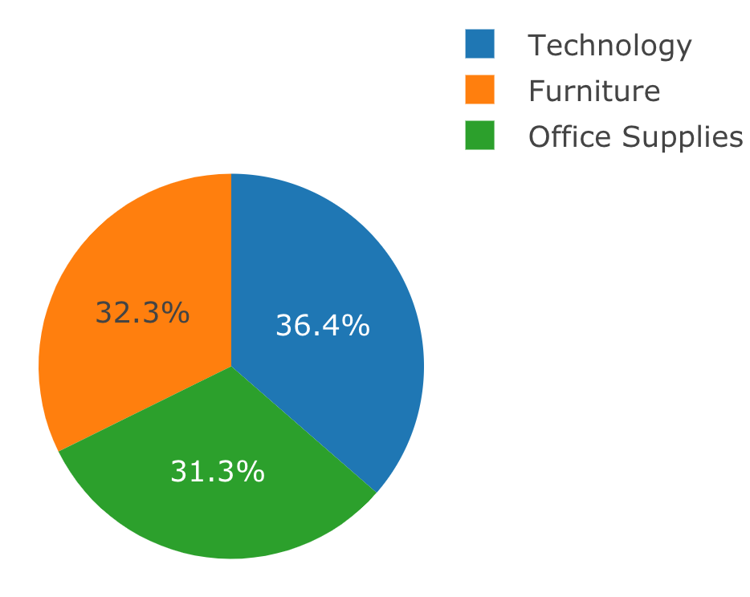
]


---
# Sales within furniture

.pull-left[
```{r}
sales <- readr::read_csv("data/sales.csv")
sales %>%
  filter(category == "Furniture") %>%
  count(sub_category, wt = sales)
#> # A tibble: 4 x 2
#>   sub_category       n
#>   <chr>          <dbl>
#> 1 Bookcases    114880.
#> 2 Chairs       328449.
#> 3 Furnishings   91705.
#> 4 Tables       206966.
```
]

.pull-right[
```{r}
sales %>%
  filter(category == "Furniture") %>%
  count(sub_category, wt = sales) %>%
  plot_ly() %>%
  add_pie(labels = ~sub_category, values = ~n)
```

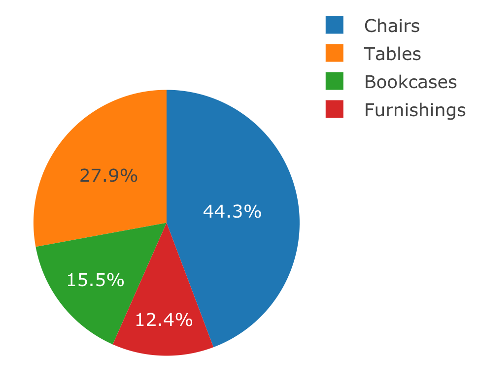
]

---

## Drill-down demo

The following Shiny app implements a drill-down for sales category/sub-category

```{r}
file.edit("shiny/07/app.R")
shiny::runApp("shiny/07")
```

Let's add a title to the sub-category pie chart showing what category is currently selected.

---
background-image: url(your-turn.jpeg)
background-size: contain
class: inverse

## Your turn

* Watch the other 3 videos of drill-down visualizations of this same `sales` dataset listed here

https://plotly-r.com/linking-views-with-shiny.html#drill-down

* How many reactive values are needed in each example?

(Hint: remember that one `reactiveVal()` was used to remember which category was clicked in the pie drill-down)

```{r, echo=FALSE, eval = TRUE}
countdown(minutes = 5, seconds = 0, bottom = 0, color_background = "black")
```


---

# `event_data()` supports many event types!

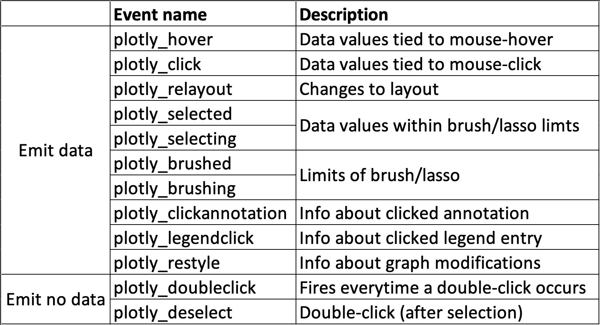

---
## Common 2D events

```{r}
plotly_example("shiny", "event_data")
```

```{r, echo = FALSE, eval = TRUE}
include_vimeo("327625843")
```

---
## Advanced application: cross-filtering

* Makes clever use of `plotly_brushing`, [event scoping](https://plotly-r.com/linking-views-with-shiny.html#scoping-events), and `Plotly.restyle()` to efficiently alter bar heights 

```{r}
plotly_example("shiny", "crossfilter")
```

```{r, echo = FALSE, eval = TRUE}
include_vimeo("318129502")
```

---
## 3D events

Brushing events aren't (yet) supported, but most everything else is!

```{r}
plotly_example("shiny", "event_data_3D")
```

```{r, echo = FALSE, eval = TRUE}
include_vimeo("327600560")
```

---
## Relayout events

.pull-left[
```r
ui <- fluidPage(
  plotlyOutput("p"),
  verbatimTextOutput("info")
)
server <- function(input, output) {
  output$p <- renderPlotly({
    plot_ly(x = 1, y = 1)
  })
  output$info <- renderPrint({
*   event_data("plotly_relayout")
  })
}
shinyApp(ui, server)
```
]

.pull-right[
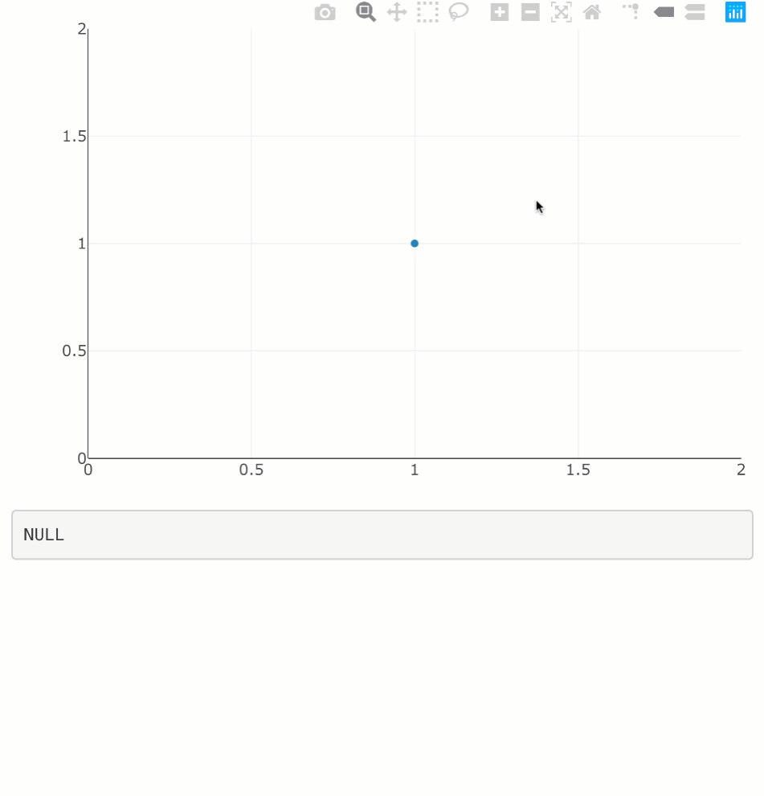
]

---
## Listening to layout edits

.pull-left[
```r
ui <- fluidPage(
  plotlyOutput("p"),
  verbatimTextOutput("info")
)
server <- function(input, output) {
  output$p <- renderPlotly({
    plot_ly(x = 1, y = 1) %>%
      layout(
        shapes = list(
          type = "line",
          x0 = 0.5, y0 = 0,
          x1 = 0.5, y1 = 1,
          xref = "paper", 
          yref = "paper"
        )
      ) %>%
*     config(edits = list(shapePosition = TRUE))
  })
  output$info <- renderPrint({
*   event_data("plotly_relayout")
  })
}
```
]

.pull-right[
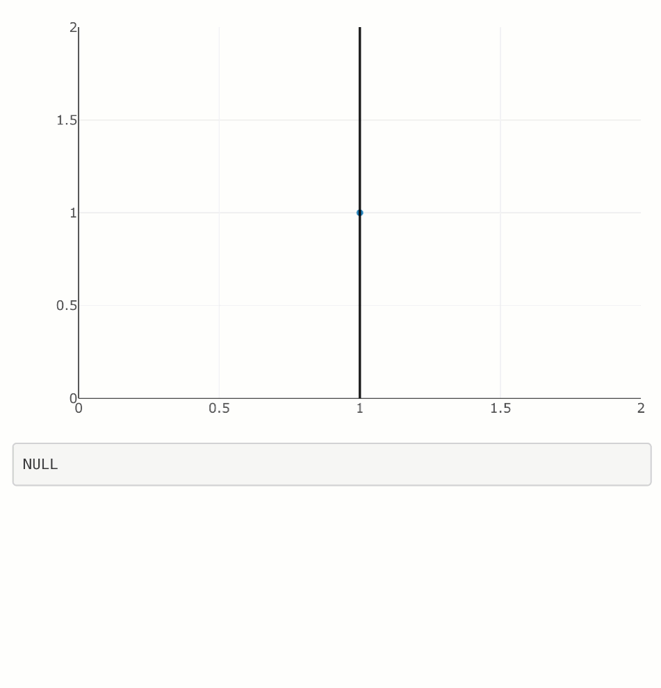
]

---
## Responding to line edits

```{r}
plotly_example("shiny", "drag_lines")
```

```{r, echo = FALSE, eval = TRUE}
include_vimeo("307597984")
```

---
## Responding to marker edits

```{r}
plotly_example("shiny", "drag_markers")
```

```{r, echo = FALSE, eval = TRUE}
include_vimeo("318338029")
```


---
background-image: url(your-turn.jpeg)
background-size: contain
class: inverse, principles

<h2 align="center"> Your Turn: (Final) your turn </h2>

Choose one of the following:

1. Ask me a question ([through sli.do](https://www.sli.do))

2. Apply something you learned to a dataset of your choice.

3. Run a `plotly_example()` from the slides and dissect how it works.


---
class: center, middle

# Thanks!

Resources for more learning:

https://plotly-r.com <br />
https://plot.ly/r <br />
https://talks.cpsievert.me <br />
https://vimeo.com/cpsievert

Find me online:

Web: <http://cpsievert.me/> <br />
Twitter: [@cpsievert](https://twitter.com/cpsievert) <br />
GitHub: [@cpsievert](https://github.com/cpsievert) <br />
Email: <cpsievert1@gmail.com>

