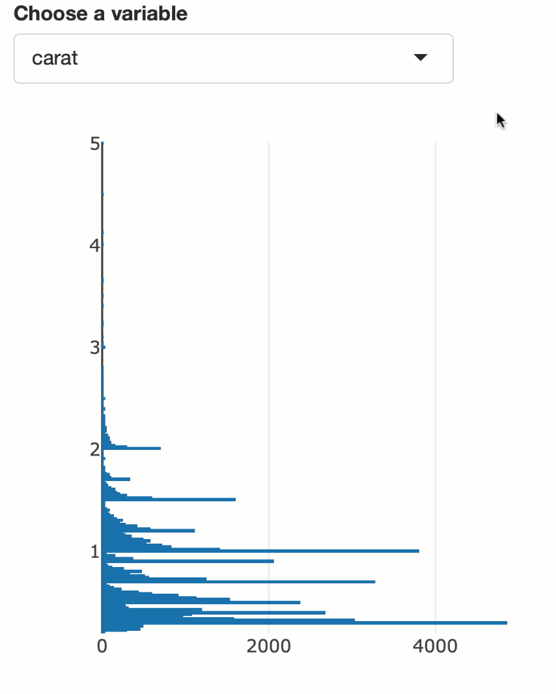

class: middle

## About me

* Software Engineer @ RStudio (Shiny team)
  * Maintain numerous R packages: **plotly**, **thematic**, **bootstraplib**, **shinymeta**, **LDAvis**.
  * Also a regular contributor to: **shiny**, **rmarkdown**, **knitr**, etc.
  
* Author of the book: [_Interactive web-based data visualization with R, plotly, and shiny_](https://plotly-r.com).
  * More of a R user guide than <https://plotly.com/r>

* PhD in statistics at Iowa State University
  * Dissertation on Interactive Statistical Graphics.

```{r, include = FALSE}
library(plotly)
library(htmltools)
library(countdown)
knitr::opts_chunk$set(
  cache = TRUE,
  message = FALSE,
  out.width = "70%",
  fig.height = 4.5,
  comment = "#>",
  collapse = TRUE,
  fig.align = "center",
  fig.retina = 2
)

include_vimeo <- function(id, width = "100%", height = "450") {
  url <- sprintf("https://player.vimeo.com/video/%s?title=0&byline=0&portrait=0", id)
  htmltools::tags$iframe(
    src = url,
    width = width,
    height = height,
    frameborder = "0",
    seamless = "seamless",
    webkitAllowFullScreen = NA,
    mozallowfullscreen = NA,
    allowFullScreen = NA
  )
}

theme_set(theme_bw(base_size = 16))

mtcars$am <- ifelse(mtcars$am == 0, "automatic", "manual")
mtcars$name <- row.names(mtcars)

library(flair)
orange <- "#FF851B"
blue <- "#0074D9"
green <- "#2ECC40"
purple <- "purple"
data <- tags$span(style = paste("color:", orange), "Data")
mappings <- tags$span(style = paste("color:", green), "Mappings")
geoms <- tags$span(style = paste("color:", blue), "Geoms")

statistics <- tags$span(style = paste("color:", purple), "Statistics")
scales <- tags$span(style = paste("color:", purple), "Scale")
facets <- tags$span(style = paste("color:", orange), "Facets")
#scales <- tags$span(style = paste("color:", green), "Scales")
theme <- tags$span(style = paste("color:", blue), "Theme")
```

```{r, echo=FALSE}
#countdown(minutes = 5, seconds = 0, bottom = 0, color_background = "black")
```

---

### Notable dataviz tools in R

* __ggplot2__: for exploratory dataviz
  * Conceptual framework enables quick iteration
  * Smart defaults, yet highly customizable
  * Rich ecosystem of [extension packages](https://exts.ggplot2.tidyverse.org/gallery/)

* __plotly__: for interactive dataviz
  * Convert __ggplot2__ into interactive web graphics
  * Binds directly to a rich and mature underlying JavaScript library
  * Support for graphical queries, linking views, animation, and more
  * Just one of [many **htmlwidgets**](http://gallery.htmlwidgets.org/)

* __shiny__: for more interactivity
    * Make _any_ R plot interactive
      * Easy to add controls for indirect manipulation
      * Possible to leverage direct manipulation as well

* __rmarkdown__: for composition and layout
  * Rich ecosystem of extensions makes it easy to create [dashboards](https://rmarkdown.rstudio.com/flexdashboard/), [websites](https://bookdown.org/yihui/rmarkdown/rmarkdown-site.html), [presentations](https://rmarkdown.rstudio.com/lesson-11.html), pdf, word, and more.
  * Increase the reproducibility and transparency of your deliverables
  

---
### ggplot2: a grammar of graphics

.pull-left[
* __ggplot2__ implements [the Grammar of Graphics](https://www.amazon.com/Grammar-Graphics-Statistics-Computing/dp/0387245448) in R.


]

.pull-right[
* Any graph can be broken down into the following components:
    1. `r data`
    2. `r mappings` (i.e. variables to visualize)
    3. `r geoms` (e.g., points, lines, rectangles, etc)
        * Statistical aggregation
        * Positional adjustment
    4. Scales
    5. Facets (i.e., small multiples)
    6. Coordinates
    7. Theme (i.e., styling)

* As a **ggplot2** user, all you _really_ need to provide is 1, 2, and 3. Everything thing else has smart defaults.

* Helps minimize the cognitive burden, especially during the iteration phase.
]

---
class: middle, inverse

### Let's start with some toy data on cars

R comes with some useful toy datasets (e.g., `mtcars`):

```{r, echo = FALSE}
tibble::as_tibble(mtcars[c("name", "wt", "mpg", "am", "cyl")])
```


---
class: middle

### Focus on 3 key aspects: `r data`, `r mappings`, and `r geoms`.

```{r ggintro, include = FALSE}
library(ggplot2)
ggplot(mtcars) + 
  geom_point(mapping = aes(x = wt, y = mpg))
```

```{r, echo = FALSE}
decorate("ggintro") %>%
  flair("mtcars", color = orange) %>%
  flair("x = wt, y = mpg", color = green) %>%
  flair("geom_point", color = blue)
```

---
class: middle

### Focus on 3 key aspects: Data, `r mappings`, and Geoms.

```{r ggcolor, include = FALSE}
library(ggplot2)
ggplot(mtcars) + 
  geom_point(mapping = aes(x = wt, y = mpg, color = am))
```

```{r, echo = FALSE}
decorate("ggcolor") %>%
  flair("color = am", color = green)
```

---
class: middle

### Focus on 3 key aspects: Data, `r mappings`, and Geoms.

```{r ggcolor-size-aes, include = FALSE}
library(ggplot2)
ggplot(mtcars) + 
  geom_point(mapping = aes(x = wt, y = mpg, color = am, shape = am, size = hp))
```

```{r, echo = FALSE}
decorate("ggcolor-size-aes") %>%
  flair('shape = am, size = hp', color = green)
```

---
class: middle

### `r geoms` (aka Layers) inherit `r data` and `r mappings` from `ggplot()`

```{r, echo = FALSE}
knitr::opts_chunk$set(fig.height = 4.25)
```

```{r gglayers, include = FALSE}
library(ggplot2)
ggplot(mtcars, aes(x = wt, y = mpg, color = am)) + 
  geom_point() +
  geom_smooth()
```

```{r, echo = FALSE}
decorate("gglayers") %>%
  flair("mtcars", color = orange) %>%
  flair("x = wt, y = mpg, color = am", color = green) %>%
  flair("geom_point", color = blue) %>%
  flair("geom_smooth", color = blue)
```


---
class: middle

### `r geoms` (aka Layers) inherit `r data` and `r mappings` from `ggplot()`

```{r, echo = FALSE}
knitr::opts_chunk$set(fig.height = 4.25)
```

```{r gglayers-inherit, include = FALSE}
library(ggplot2)
ggplot(mtcars, aes(x = wt, y = mpg, color = am)) + 
  geom_point(aes(shape = am), size = 3) +
  geom_smooth(aes(linetype = am))
```

```{r, echo = FALSE}
decorate("gglayers-inherit") %>%
  flair("mtcars", color = orange) %>%
  flair("x = wt, y = mpg, color = am", color = green) %>%
  flair("shape = am", color = green) %>%
  flair("linetype = am", color = green) %>%
  flair("geom_point", color = blue) %>%
  flair("geom_smooth", color = blue)
```

---
class: middle

### `r geoms` (aka Layers) are parameterized by more than visuals (e.g., `r statistics`)

```{r gglayers2, include = FALSE}
library(ggplot2)
ggplot(mtcars, aes(x = wt, y = mpg, color = am)) + 
  geom_point(aes(shape = am), size = 3) +
  geom_smooth(aes(linetype = am), method = "lm", se = FALSE)
```

```{r, echo = FALSE}
decorate("gglayers2") %>%
  flair("geom_smooth", color = blue) %>%
  flair('method = "lm", se = FALSE', color = purple)
```

---
class: middle

### Different `r geoms` (aka Layers) have different (e.g., `r statistics`)

```{r gglayers3, include = FALSE}
library(ggplot2)
ggplot(mtcars, aes(x = wt, color = am)) + 
  geom_density(kernel = "gaussian")
```

```{r, echo = FALSE}
decorate("gglayers3") %>%
  flair("geom_density", color = blue) %>%
  flair('kernel = "triangular"', color = purple)
```

---
class: middle

### Use `r facets` to see how patterns change across sub-groups

```{r facets, include = FALSE}
library(ggplot2)
ggplot(mtcars, aes(x = wt, color = factor(cyl))) + 
  geom_density() +
  facet_wrap(~am)
```

```{r, echo = FALSE}
decorate("facets", out.width = '"90%"', fig.height = 3.25) %>%
  flair("facet_wrap", color = orange)
```

---
class: middle

### ggplotly(): Make ggplot2 interactive and web-based!

```r
library(plotly)
ggplotly() # picks up on the previously printed ggplot 
```

<div align="center">
<iframe src="gghello.html" height="425" width="100%" scrolling="no" seamless="seamless" frameBorder="0"></iframe>
</div>

---
### Works with nearly any ggplot2 geom

```r
library(plotly)
p <- ggplot(mtcars, aes(x = wt, y = mpg, color = am)) + 
  geom_point() +
  geom_smooth(method = "lm", se = FALSE)
ggplotly(p)
```

<div align="center">
<iframe src="ggsmooth.html" height="425" width="100%" scrolling="no" seamless="seamless" frameBorder="0"></iframe>
</div>

---
### Customized ggplotly() tooltips ([learn more](https://plotly-r.com/controlling-tooltips.html#tooltip-text-ggplotly))

```{r ggsmooth-tooltip, eval = FALSE, echo = FALSE}
library(plotly)
p <- ggplot(mtcars, aes(x = wt, y = mpg, color = am)) + 
  geom_point(aes(text = name)) +
  geom_smooth(method = "lm", se = FALSE)
ggplotly(p, tooltip = "text")
```

```{r, echo = FALSE}
decorate("ggsmooth-tooltip", eval = FALSE) %>%
  flair("text = name") %>%
  flair('tooltip = "text"')
```


<div align="center">
<iframe src="ggsmooth-tooltip.html" height="425" width="100%" scrolling="no" seamless="seamless" frameBorder="0"></iframe>
</div>

---
### Use plotly's API to customize further!

```{r ggsmooth-custom, eval = FALSE}
last_plot() %>%
  style(hoverlabel = list(bgcolor = "white"), hoverinfo = "x+y+text") %>%
  layout(
    xaxis = list(showspikes = TRUE),
    yaxis = list(showspikes = TRUE)
  )
```

<div align="center">
<iframe src="ggsmooth-custom.html" height="425" width="100%" scrolling="no" seamless="seamless" frameBorder="0"></iframe>
</div>


---
### Trouble with `ggplotly()`? Try `plot_ly()`!

`plot_ly()` is a more "direct" interface to the underlying plotly.js (JavaScript) library.

```r
plot_ly(mtcars) %>%
  add_markers(x = ~wt, y = ~mpg, color = ~am)
```

```{r, echo = FALSE, out.width="100%"}

```


---
### `plot_ly()`: also inspired by grammar of graphics

Focus on 3 key aspects: `r data`, `r mappings`, and `r geoms`.

```{r plot_ly, include = FALSE}
plot_ly(mtcars) %>%
  add_markers(x = ~wt, y = ~mpg, color = ~am)
```

```{r, echo = FALSE}
decorate("plot_ly", eval = FALSE) %>%
  flair("mtcars", color = orange) %>%
  flair('x = ~wt, y = ~mpg, color = ~am', color = green) %>%
  flair("add_markers", color = blue)
```

```{r, echo = FALSE, out.width="100%"}

```


---
### `plot_ly()`: embraces the pipe

To add to (or modify) a **plotly** object, use `%>%` instead of `+`

```{r pipe, include = FALSE}
plot_ly(mtcars) %>%
  add_markers(x = ~wt, y = ~mpg, color = ~am, symbol = ~am)
```

```{r, echo = FALSE}
decorate("pipe", eval = FALSE) %>%
  flair("%>%")
```

```{r, echo = FALSE, out.width="100%"}

```

---
### Tip: Scale up with `toWebGL()` (also works with `ggplotly()`)

```{r diamonds-raw, eval = FALSE, echo = FALSE}
plot_ly(diamonds) %>%
  add_markers(x = ~carat, y = ~price) %>%
  toWebGL()
```

```{r, echo = FALSE}
decorate("diamonds-raw", eval = FALSE) %>%
  flair("toWebGL")
```

```{r, echo = FALSE, out.width="85%"}

```

`toWebGL()` changes rendering to HTML Canvas instead of SVG. The difference is similar to using `png()` instead of `pdf()` for static plots ([lower-quality, but way more scalable](https://vector-conversions.com/vectorizing/raster_vs_vector.html)).

---
### Tip: Combat overplotting with alpha blending

```{r diamonds-alpha, eval = FALSE, echo = FALSE}
plot_ly(diamonds) %>%
  add_markers(x = ~carat, y = ~price, alpha = 0.1) %>%
  toWebGL()
```

```{r, echo = FALSE}
decorate("diamonds-alpha", eval = FALSE) %>%
  flair("alpha = 0.1")
```

```{r, echo = FALSE, out.width="85%"}

```

---
### Tip: Combat overplotting with summaries

```{r diamonds-summary, eval = FALSE, echo = FALSE}
plot_ly(diamonds) %>%
  add_histogram2d(x = ~carat, y = ~price)
```

```{r, echo = FALSE}
decorate("diamonds-summary", eval = FALSE) %>%
  flair("add_histogram2d")
```

```{r, echo = FALSE, out.width="85%"}

```

For "heavy-tailed" distributions, it can be useful to perform the summary (e.g., log counts) in R yourself. For more on this, see <https://plotly-r.com/frequencies-2d>

---
class: middle, inverse 

# Demo

---

## Some motivation: COVID explorer (by ft.com)

<div align="center">
<a href="https://ft.com/covid19">
  
</a>
</div>

---
## The data

```r
library(plotly)
library(tidyverse)
  
covid <- read_csv("https://covidtracking.com/api/v1/states/daily.csv") %>%
  mutate(date = lubridate::ymd(as.character(date)))
  
select(covid, date, deathIncrease, state)
```

```r
# A tibble: 7,857 x 3
   date       deathIncrease state
   <date>             <dbl> <chr>
 1 2020-07-23             0 AK   
 2 2020-07-23            33 AL   
 3 2020-07-23             6 AR   
 4 2020-07-23             0 AS   
 5 2020-07-23            89 AZ   
 6 2020-07-23           157 CA   
 7 2020-07-23             0 CO   
 8 2020-07-23             4 CT   
 9 2020-07-23             1 DC   
10 2020-07-23             2 DE   
# … with 7,847 more rows
```

---

## Simple time series by state

```r
plot_ly(covid) %>%
  group_by(state) %>%
  add_lines(x = ~date, y = ~deathIncrease, text = ~state)
```

<div align="center">
 
</div>


---

## Highlight a state on click

```{r click, eval = FALSE, echo = FALSE}
plot_ly(highlight_key(covid, ~state)) %>%
  group_by(state) %>%
  add_lines(x = ~date, y = ~deathIncrease, text = ~state)
```

```{r, echo = FALSE}
decorate("click", eval = FALSE) %>%
  flair("highlight_key(covid, ~state)")
```

<div align="center">
<a href="covid-click.html">
 
</a>
</div>


---
### Highlight on hover & search by name

```{r hover, eval = FALSE, echo = FALSE}
plot_ly(highlight_key(covid, ~state)) %>%
  group_by(state) %>%
  add_lines(x = ~date, y = ~deathIncrease, text = ~state) %>%
  highlight("plotly_hover", selectize = TRUE)
```

```{r, echo = FALSE}
decorate("hover", eval = FALSE) %>%
  flair('highlight("plotly_hover", selectize = TRUE)')
```

<div align="center">
<a href="covid-hover.html">
 
</a>
</div>

---
### Persistent highlight with dynamic coloring

```{r persist, eval = FALSE, echo = FALSE}
plot_ly(highlight_key(covid, ~state)) %>%
  group_by(state) %>%
  add_lines(x = ~date, y = ~deathIncrease, text = ~state) %>%
  highlight("plotly_hover", selectize = TRUE, dynamic = TRUE, persistent = TRUE)
```

```{r, echo = FALSE}
decorate("persist", eval = FALSE) %>%
  flair_rx("dynamic = TRUE, persistent = TRUE")
```

<div align="center">
<a href="covid-persist.html">
 
</a>
</div>

---
### Death totals by state

```{r totals, eval = FALSE, echo = FALSE}
plot_ly(highlight_key(covid, ~state)) %>%
  group_by(state) %>%
  summarise(total = sum(deathIncrease)) %>%
  add_bars(x = ~total, y = ~forcats::fct_reorder(state, total))
```

```{r, echo = FALSE}
decorate("totals", eval = FALSE) %>%
  flair("summarise(total = sum(deathIncrease)) %>%")
```

<div align="center">
 
</div>

---
### Linked highlighting (i.e., graphical queries)

<iframe src="covid-linked.html" width="100%" height="550" id="igraph" scrolling="no" seamless="seamless" frameBorder="0"> </iframe>


---
### The code

```{r covid-linked, eval = FALSE, echo = FALSE}
covid_highlight <- highlight_key(covid, ~state)

p1 <- plot_ly(covid_highlight, color = I("black")) %>%
  group_by(state) %>%
  summarise(total = sum(deathIncrease)) %>%
  add_bars(x = ~total, y = ~forcats::fct_reorder(state, total))

p2 <- plot_ly(covid_highlight, color = I("black")) %>%
  group_by(state) %>%
  add_lines(x = ~date, y = ~deathIncrease, text = ~state)

subplot(p1, p2, nrows = 1, widths = c(0.3, 0.7)) %>%
  highlight(selectize = TRUE, dynamic = TRUE) %>%
  layout(showlegend = FALSE, barmode = "overlay")
```

```{r, echo = FALSE}
decorate("covid-linked", eval = FALSE) %>%
  flair("covid_highlight") %>%
  flair("subplot")
```


---
background-image: url(server-client-highlight.svg)
background-size: contain
class: middle, right

## All the interactivity handled client-side!

---
background-image: url(server-client-highlight.svg)
background-size: contain
class: middle, right

## Easier to share and maintain

---
background-image: url(server-client-highlight.svg)
background-size: contain
class: middle, right

## Learn more at [plotly-r.com](https://plotly-r.com/client-side-linking.html)

---
background-image: url(server-client.svg)
background-size: contain
class: middle, right

## [Server-side linking](https://plotly-r.com/linking-views-with-shiny.html) is _way_ more powerful

---
background-image: url(server-client.svg)
background-size: contain
class: middle, right

## shiny makes it quite easy!

---
### shiny: Interactive webapps in R

.pull-left[
* Easily turn your R code into an interactive GUI
  * Makes it easy to make R code *react* to user inputs.
  
* Allow users to quickly explore different parameters, models, algorithms, etc.
  * Widely used by Pharma companies to speed collaboration between scientists, analysts, and managers during drug development.

* As we'll see, it's a very powerful way to share information between different outputs (e.g., `plotlyOutput()`, `textOutput()`, `leafletOutput()`, etc)
]

.pull-right[

]


---
### Use Shiny inputs to trigger re-render

.pull-left[
```r
library(shiny)
library(plotly)

ui <- fluidPage(
* selectInput(
*   "y", "Choose a variable", 
*   choices = names(diamonds)
* ),
  plotlyOutput("p")
)

server <- function(input, output) {

  output$p <- renderPlotly({
    plot_ly(
*     y = diamonds[[input$y]]
    )
  })
  
}

shinyApp(ui, server)
```
]

.pull-right[

]

---
### Access output interaction as an input value

.pull-left[
```r
library(shiny)
library(plotly)

ui <- fluidPage(
  selectInput(
    "y", "Choose a variable", 
    choices = names(diamonds)
  ),
  plotlyOutput("p"),
  verbatimTextOutput("hover")
)

server <- function(input, output) {
  output$p <- renderPlotly({
    plot_ly(y = diamonds[[input$y]])
  })
* output$hover <- renderPrint({
*   #Think of this like an input value
*   event_data("plotly_hover")
* })
}

shinyApp(ui, server)
```
]

.pull-right[

]

---
### Many types of output interactions

Access hover, click, click&drag, etc, as input values:

* `plotly::plotlyOutput()`
    * https://plotly-r.com/linking-views-with-shiny.html#shiny-plotly-inputs
    
* `leaflet::leafletOutput()`
    * https://rstudio.github.io/leaflet/shiny.html

* `DT::dataTableOutput()`
    * https://rstudio.github.io/DT/shiny.html

* `shiny::plotOutput()` & `shiny::imageOutput()`
    * Interactive plots section of https://shiny.rstudio.com/gallery/
    * https://shiny.rstudio.com/articles/plot-interaction.html
    * https://shiny.rstudio.com/articles/selecting-rows-of-data.html
    * https://shiny.rstudio.com/articles/plot-interaction-advanced.html
    
.footnote[
Many other [htmlwidgets](http://www.htmlwidgets.org/) packages also expose output interactions as input values.
]


---
## Brushing a histogram to update scatterplot

```{r, echo = FALSE}
include_vimeo("318129005", height = 450)
```

---
## Useful layout attributes for histogram brushing

```r
plot_ly(diamonds, x = ~depth) %>%
  layout(
    dragmode = "select", 
    selectdirection = "h"
  )
```

<div align="center">
  
</div>


---
## Accessing brush limits

.pull-left[
```r
library(shiny)

ui <- fluidPage(
  plotlyOutput("bars"),
  verbatimTextOutput("info")
)

server <- function(input, output) {
  
  output$bars <- renderPlotly({
    plot_ly(diamonds, x = ~depth) %>%
      layout(dragmode = "select", selectdirection = "h")
  })
  
  output$info <- renderPrint({
*   event_data("plotly_brushing")
  })
}

shinyApp(ui, server)
```
]

.pull-right[

]


---
## Applying the brush (i.e., selecting rows)

.pull-left[
```r
server <- function(input, output) {
  
  output$bars <- renderPlotly({
    plot_ly(diamonds, x = ~depth) %>%
      layout(dragmode = "select", selectdirection = "h")
  })
  
  brushed <- reactive({
    brush <- event_data("plotly_brushing")
*    if (is.null(brush)) {
*      TRUE
*    } else {
*      between(
*        diamonds$depth, 
*        brush$x[1], 
*        brush$x[2]
*      )
*    }
  })
  
  output$info <- renderPrint({
    summary(brushed())
  })
}
```
]

.pull-right[

]

---
## Updating the scatterplot

.pull-left[
```r
server <- function(input, output) {

  output$bars <- renderPlotly({
    plot_ly(diamonds, x = ~depth) %>%
      layout(dragmode = "select", selectdirection = "h")
  })
  
  brushed <- reactive({
    brush <- event_data("plotly_brushed")
    if (is.null(brush)) TRUE else between(diamonds$depth, brush$x[1], brush$x[2])
  })
  
  output$scatter <- renderPlotly({
    diamonds %>%
*     filter(brushed()) %>%
      plot_ly(
        x = ~carat, 
        y = ~price, 
        alpha = 0.2
      ) %>%
      toWebGL()
  })
}
```
]

.pull-right[

]

---
## Performance note: use `toWebGL()`!

.pull-left[
```r
server <- function(input, output) {

  output$bars <- renderPlotly({
    plot_ly(diamonds, x = ~depth) %>%
      layout(dragmode = "select", selectdirection = "h")
  })
  
  brushed <- reactive({
    brush <- event_data("plotly_brushing")
    if (is.null(brush)) TRUE else between(diamonds$depth, brush$x[1], brush$x[2])
  })
  
  output$scatter <- renderPlotly({
    diamonds %>%
      filter(brushed()) %>%
      plot_ly(
        x = ~carat, 
        y = ~price, 
        alpha = 0.2
      ) %>%
*     toWebGL()
  })
}
```
]

.pull-right[

<br>
<br>
<br>
Uses a Canvas-based renderer instead of SVG (think png versus pdf)
]

---
## Performance note: use summaries!

.pull-left[
```r
server <- function(input, output) {

  output$bars <- renderPlotly({
    plot_ly(diamonds, x = ~depth) %>%
      layout(dragmode = "select", selectdirection = "h")
  })
  
  brushed <- reactive({
    brush <- event_data("plotly_brushing")
    if (is.null(brush)) TRUE else between(diamonds$depth, brush$x[1], brush$x[2])
  })
  
  output$scatter <- renderPlotly({
    diamonds %>%
      filter(brushed()) %>%
      plot_ly(
        x = ~carat, 
        y = ~price, 
        alpha = 0.2
      ) %>%
*     add_histogram2dcontour()
  })
}
```
]

.pull-right[

<br>
<br>
<br>
It can also pay to minimize the amount of data sent over-the-wire (make this even more scalable by [summarizing server-side](https://github.com/ropensci/plotly/blob/master/inst/examples/shiny/crossfilter_kde/app.R))
]
  
---
class: inverse, middle, principles

## General notes on brushing responsively

* `plotly_brushed` / `plotly_selected`: fires once after mouseup.
* `plotly_brushing` / `plotly_selecting`: fires rapidly while brush moving.

* If the response to a brush event is slow, consider these options:
    * Do continous updates help? If not, use `plotly_brushed`.
    * Do intermediate updates matter? If not, `debounce()` rapid firing events.
    * Use `plotlyProxy()` to partially modify plotly graphs

* Learn more about improving responsiveness:
  - https://plotly-r.com/linking-views-with-shiny.html#shiny-performance
  - https://resources.rstudio.com/webinars/accessing-and-responding-to-plotly-events-in-shiny-carson-sievert

---
## How about brushing the scatterplot?

<div align="center">
  
</div>

---
## Accessing brushed data points

.pull-left[
```r
library(shiny)

ui <- fluidPage(
  plotlyOutput("scatter"),
  verbatimTextOutput("info")
)

server <- function(input, output) {
  
  output$scatter <- renderPlotly({
    plot_ly(
      diamonds, alpha = 0.2,
      x = ~carat, y = ~price
    ) %>%
    toWebGL() %>%
*   event_register("plotly_selecting")
  })
  
  output$info <- renderPrint({
*   event_data("plotly_selecting")
  })
  
}

shinyApp(ui, server)
```
]

.pull-right[

]

---
## How do we determine which rows are brushed?

.pull-left[
```r
library(shiny)

ui <- fluidPage(
  plotlyOutput("scatter"),
  verbatimTextOutput("info")
)

server <- function(input, output) {
  
  output$scatter <- renderPlotly({
    plot_ly(
      diamonds, alpha = 0.2,
      x = ~carat, y = ~price
    ) %>%
    toWebGL() %>%
*   event_register("plotly_selecting")
  })
  
  output$info <- renderPrint({
*   event_data("plotly_selecting")
  })
  
}

shinyApp(ui, server)
```
]

.pull-right[

]

---
## Attach a row identifier!

.pull-left[
```r
library(shiny)

ui <- fluidPage(
  plotlyOutput("scatter"),
  verbatimTextOutput("info")
)

server <- function(input, output) {
  
  output$scatter <- renderPlotly({
    plot_ly(
      diamonds, alpha = 0.2,
      x = ~carat, y = ~price,
*     customdata = seq(1, nrow(diamonds))
    ) %>%
    toWebGL() %>%
    event_register("plotly_selecting")
  })
  
  output$info <- renderPrint({
    event_data("plotly_selecting")
  })
  
}

shinyApp(ui, server)
```
]

.pull-right[

]

---
## Updating the histogram

.pull-left[
```r
server <- function(input, output) {
  
  output$scatter <- renderPlotly({
    plot_ly(diamonds, alpha = 0.2, x = ~carat, y = ~price, customdata = seq(1, nrow(diamonds))) %>% toWebGL() %>% event_register("plotly_selecting")
  })
  
  output$bars <- renderPlotly({
    d <- event_data("plotly_selecting")
*   if (is.null(d)) {
*     plot_ly(diamonds, x = ~depth)
*   } else {
*     diamonds %>%
*       slice(d$customdata) %>%
*       plot_ly(x = ~depth)
*   }
  })
  
}

shinyApp(ui, server)
```
]

.pull-right[

]

---
## Pro-tip: overlay selections with relative frequencies!

.pull-left[
```r
server <- function(input, output) {
  
  output$scatter <- renderPlotly({
    plot_ly(diamonds, alpha = 0.2, x = ~carat, y = ~price, customdata = seq(1, nrow(diamonds)), selected = list(marker = list(color = "red"))) %>% toWebGL() %>% event_register("plotly_selecting")
  })
  
  output$bars <- renderPlotly({
    base <- diamonds %>%
      plot_ly(
        x = ~depth, alpha = 0.3,
*       histnorm = "probability density"
      ) %>%
      add_histogram()
    
    d <- event_data("plotly_selecting")
    if (is.null(d))  return(base)
    
    add_histogram(
      base, color = I("red"),
      data = slice(diamonds, d$customdata)
    )
  })
  
}

shinyApp(ui, server)
```
]

.pull-right[

]

---

### Cross-filtering 350,000 flights

```{r, echo = FALSE}
include_vimeo("318129502")
```

[App](https://testing-apps.shinyapps.io/crossfilter/) / [Code](https://github.com/ropensci/plotly/blob/master/inst/examples/shiny/crossfilter/app.R)

This approach scales to about 5 million on my laptop

---
### Cross-filter with multiple comparisons (i.e., persistent selection)

```{r, echo = FALSE}
include_vimeo("307598246")
```

[App](https://testing-apps.shinyapps.io/crossfilter_compare) / [Code](https://github.com/ropensci/plotly/blob/master/inst/examples/shiny/crossfilter_compare/app.R)

---
### Persistent selection is _very_ useful, but tricky to implement!

```{r, echo = FALSE}
include_vimeo("353646796")
```

[Code](https://tutorials.cpsievert.me/20190821/#32)


---
class: inverse, middle, principles

## Programming with 'hidden state'

* Persistent selection requires management of 'hidden state'
  * Plot updates need to be aware of previous user selection(s)

* In general, a Shiny app has 'hidden state' if output(s) can't be fully determined by the UI's current `input` values

* Programming with 'hidden state' enables fancy interactivity such as cross-filter, drill-down, etc, but it also:
  * Makes reactive logic more difficult to reason about
  * Makes some Shiny features more difficult to leverage (e.g. bookmarking)

---
### Managing state with `reactiveVal()`

.pull-left[
```r
library(shiny)

ui <- fluidPage(
  actionButton("minus", "-1"),
  actionButton("plus", "+1"),
  textOutput("value")
)

server <- function(input, output) {
  val <- reactiveVal(0)     
  observeEvent(input$minus, {
    newValue <- val() - 1
    val(newValue)
  })
  observeEvent(input$plus, {
    newValue <- val() + 1
    val(newValue)
  })
  output$value <- renderText(val())
}

shinyApp(ui, server)
```
]

.pull-right[

]

---
### Storing event data

.pull-left[
```r
hover_data <- reactiveVal()
observeEvent(event_data("plotly_hover"), {
  new_hover <- rbind(
    hover_data(), 
    event_data("plotly_hover")
  )
  hover_data(new_hover)
})
observeEvent(event_data("plotly_doubleclick"), {
  hover_data(NULL)
})
```
]

.pull-right[

]


---
### What about 'drill-down'?

```{r, echo = FALSE}
include_vimeo("328763167", height = 450)
```

https://plotly-r.com/linking-views-with-shiny.html#drill-down

---
### Drill-down across multiple views!

```{r, echo = FALSE}
include_vimeo("328768848")
```

https://plotly-r.com/linking-views-with-shiny.html#drill-down

---
### UI pro-tip: leave 'breadcrumbs'

```{r, echo = FALSE}
include_vimeo("328770954")
```

https://plotly-r.com/linking-views-with-shiny.html#drill-down

---
### A 'drill-down' example that doesn't require hidden state

```{r, echo = FALSE}
include_vimeo("307597838", height = 500)
```

---
### sales transactions

.pull-left[
```r
library(tidyverse)
sales <- read_csv("data/sales.csv")
glimpse(sales)
```

```r
#> Observations: 9,994
#> Variables: 5
#> $ id           <chr> "CG-12520", "CG-12520", "DV-13045", "SO-20335…
#> $ category     <chr> "Furniture", "Furniture", "Office  Supplies", …
#> $ sub_category <chr> "Bookcases", "Chairs", "Labels", "Tables", "S…
#> $ order_date   <date> 2016-11-08, 2016-11-08, 2016-06-12, 2015-10-…
#> $ sales        <dbl> 261.9600, 731.9400, 14.6200, 957.5775, 22.368…
```
]

.pull-right[
```r
sales %>%
  group_by(category) %>%
  summarise(n = sum(sales))
```

```r
#> # A tibble: 3 x 2
#>   category              n
#>   <chr>             <dbl>
#> 1 Furniture       742000.
#> 2 Office Supplies 719047.
#> 3 Technology      836154.
```
]


---
### sales transactions (continued)

.pull-left[
```r
library(tidyverse)
sales <- read_csv("data/sales.csv")
glimpse(sales)
```

```r
#> Observations: 9,994
#> Variables: 5
#> $ id           <chr> "CG-12520", "CG-12520", "DV-13045", "SO-20335…
#> $ category     <chr> "Furniture", "Furniture", "Office  Supplies", …
#> $ sub_category <chr> "Bookcases", "Chairs", "Labels", "Tables", "S…
#> $ order_date   <date> 2016-11-08, 2016-11-08, 2016-06-12, 2015-10-…
#> $ sales        <dbl> 261.9600, 731.9400, 14.6200, 957.5775, 22.368…
```
]

.pull-right[
```r
sales %>%
  count(category, wt = sales)
```

```r
#> # A tibble: 3 x 2
#>   category              n
#>   <chr>             <dbl>
#> 1 Furniture       742000.
#> 2 Office Supplies 719047.
#> 3 Technology      836154.
```
]

---
### sales transactions (continued)

.pull-left[
```r
library(tidyverse)
sales <- read_csv("data/sales.csv")
glimpse(sales)
```

```r
#> Observations: 9,994
#> Variables: 5
#> $ id           <chr> "CG-12520", "CG-12520", "DV-13045", "SO-20335…
#> $ category     <chr> "Furniture", "Furniture", "Office  Supplies", …
#> $ sub_category <chr> "Bookcases", "Chairs", "Labels", "Tables", "S…
#> $ order_date   <date> 2016-11-08, 2016-11-08, 2016-06-12, 2015-10-…
#> $ sales        <dbl> 261.9600, 731.9400, 14.6200, 957.5775, 22.368…
```
]

.pull-right[
```r
sales %>%
  count(category, wt = sales) %>%
  plot_ly(x = ~category, y = ~n)
```

]


---
### Accessing sales category clicks

.pull-left[
```r
library(shiny)
ui <- fluidPage(
  plotlyOutput("category"),
* verbatimTextOutput("info")
)
server <- function(input, output) {
  output$category <- renderPlotly({
    sales %>%
      count(category, wt = sales) %>%
      plot_ly(x = ~category, y = ~n)
  })
  output$info <- renderPrint({
*   event_data("plotly_click")
  })
}
shinyApp(ui, server)
```
]

.pull-right[

]

---
### Plotting sub-categories

.pull-left[
```r
library(shiny)
ui <- fluidPage(
  plotlyOutput("category"),
* plotlyOutput("sub_category")
)
server <- function(input, output) {
  output$category <- renderPlotly({
    sales %>%
      count(category, wt = sales) %>%
      plot_ly(x = ~category, y = ~n)
  })
  output$sub_category <- renderPlotly({
    d <- event_data("plotly_click")
    if (is.null(d)) return(NULL)
    
*   sales %>%
*     filter(category %in% d$x) %>%
*     count(sub_category, wt = sales) %>%
*     plot_ly(x = ~sub_category, y = ~n)
  })
}
shinyApp(ui, server)
```
]

.pull-right[

]


---
class: inverse, middle, principles

### In summary

* **ggplot2** + **plotly** + **shiny** + **rmarkdown** => powerful, flexible, & reproducible toolchain for interactive dataviz.

* Use `ggplotly()` and/or [shiny::renderPlot()](https://shiny.rstudio.com/articles/#graphics) to make your **ggplot2** plots interactive.

* Use `highlight_key()` & `highlight()` for [client-side graphical queries](https://plotly-r.com/client-side-linking.html).

* Use `plotly::event_data()` for [server-side linking with **shiny**](https://plotly-r.com/linking-views-with-shiny.html).
  * BTW, you can also create [event handlers in JavaScript](https://plotly-r.com/javascript.html)
  * Improve responsiveness with [partial updating](https://plotly-r.com/linking-views-with-shiny.html#shiny-performance).

* Use `shiny::reactiveVal()` whenever the _next_ view depends on the _previous_ view.
  * Enables persisting selection, which enables end user to make comparisons.

---
### Go forth, create linked views!

```{r, echo = FALSE}
include_vimeo("372903411")
```

Awesome example of linking views with Shiny in Flexdashboard by Kyle Walker https://walkerke.shinyapps.io/neighborhood_diversity/


---
background-image: url(rstudio.svg)
background-size: 90%
class: principles, center

## Thanks for listening! Questions?

<br>
<br>
<br>
<br>
<br>
<br>
<br>
<br>
<br>
<br>
<br>
<br>

Slides <https://bit.ly/cdc-data-viz> <br>
`r icon::fa_twitter()` <a href="https://twitter.com/cpsievert">@cpsievert</a> <br>
`r icon::fa_github()` <a href="https://github.com/cpsievert">@cpsievert</a> <br>
`r icon::fa_envelope()` <cpsievert1@gmail.com> <br>
`r icon::fa_globe()` [cpsievert.me](https://cpsievert.me)

